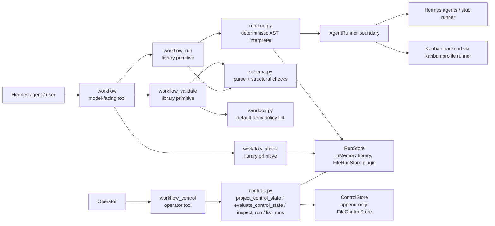
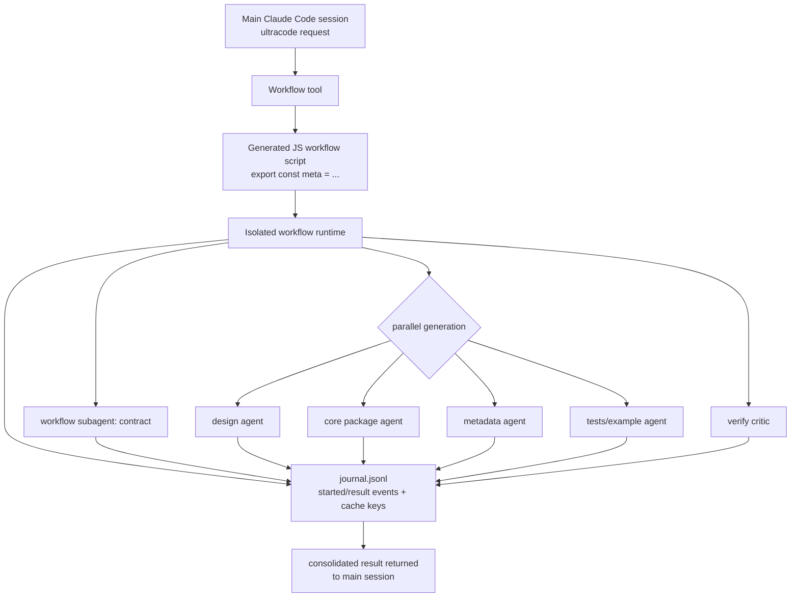
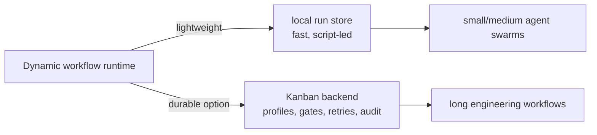

# hermes-plugin-dynamic-workflows

A prototype Hermes Agent plugin for **Claude Code–style dynamic workflows**: a lightweight,
sandboxed orchestration runtime where an agent can validate, run, and inspect workflow definitions
made of `agent`, `kanban_agent`, `if`, `parallel`, `pipeline`, and `phase` steps.

The product-shaped surface is now the single model-facing `workflow` tool: validate with `dry_run`,
run with a workflow definition, or inspect an existing run with `run_id`. The lower-level
`workflow_validate`, `workflow_run`, and `workflow_status` functions remain as explicit
library/debug/operator primitives.

This repo is intentionally small: pure Python 3.11 stdlib, no runtime dependencies, no network, and
no generated-code execution. Workflow definitions are declarative JSON and all real work crosses one
explicit `AgentRunner` boundary; parent-owned persistence writes only run snapshots and compact
journal events.

> status: research/prototype scaffold. useful for modeling the plugin surface and runtime shape;
> not a production sandbox yet.

## What this provides

| Surface | Purpose |
| --- | --- |
| `workflow` tool | Single model-facing entry point: dry-run validate, run a definition, or inspect an existing run id. |
| `workflow_control` tool | Operator surface: list active/recent runs and blocked waits (`overview`), inspect one run's compact control state/waits/links plus run-level enforcement decisions (`status`), or record an append-only pause/resume/stop/task_stop/retry intent. |
| `workflow_validate` function | Parse and statically validate a workflow definition without side effects. |
| `workflow_run` function | Execute a validated workflow in the deterministic skeleton runtime. |
| `workflow_status` function | Query status/progress/result for a workflow run id. |

The current runtime supports:

- declarative JSON workflow definitions
- `$ref:inputs.<key>` and `$ref:<step>.output.<field>` data wiring
- deterministic `agent` / `kanban_agent` / `if` / `parallel` / `pipeline` / `phase` composition
- declarative saved workflow templates via catalog listing and `run_template`
- flat structured-output schema checks
- default-deny sandbox policy linting
- in-memory run storage for library use
- parent-owned filesystem run storage for plugin use: `snapshot.json` + compact `journal.jsonl`
- a Hermes plugin entrypoint: `plugin.yaml` + root `__init__.py::register(ctx)`
- a subprocess **workflow script VM**: run model-authored Python orchestration scripts out-of-process under a static launch gate, scrubbed env, restricted builtins, and a parent-owned RPC capability broker (library/operator primitives `workflow_validate_script` / `run_workflow_script`)
- a versioned **saved script harness catalog**: validate, save, list, inspect, and run reusable Python workflow-script harnesses by name/version via `FileWorkflowScriptCatalog` and `workflow` actions (`script_catalog`, `script_save`, `script_inspect`, `run_script`)
- a first **loop-controller** slice for feedback-driven agent workflows: validate a generic loop spec, run injected sensors/verifiers and actuators through explicit controller states, retry noisy sensors once, and halt on step/time/budget/stall brakes without trusting agent self-report
- backend-neutral **scoped actuator grants**: a loop actuator requests an explicit, expiring, audited session-launch/control grant through an injected broker instead of holding a raw shell token or browser cookie; issued handles persist and re-validate across restarts, and denied/expired/credential-bearing grants fail closed in `halted_grant_denied`
- backend-neutral **resource lifecycle finalizers**: loop actuators can register credential-free resources (ATH listener, Relay session/work context, process, temp workspace, etc.) plus cleanup finalizers; terminal success/failure/timeout paths run matching finalizers through an injected adapter, persist auditable cleanup results, and fail success closed when a `required` finalizer fails
- a backend-neutral **finalizer adapter registry**: hosts can register action handlers such as `ath.listener.retire` or `relay.session.close` behind `ResourceFinalizerRegistry` without Dynamic Workflows importing ATH/Relay code
- backend-neutral **operator controls, status & wait inspection**: append-only pause/resume/stop/task_stop/retry control records (durable `FileControlStore`, never deletes the audit trail), a compact control-state projection (stop is terminal; idempotent retry lineage with explicit replacement refs), wait inspection from existing loop suspensions and durable Kanban card states, and `inspect_run` / `list_runs` projections behind the model-neutral `workflow_control` operator tool
- backend-neutral **control enforcement decisions**: a pure `evaluate_control_state(state, operation, target_ref?)` seam (plus `may_start_work` / `may_continue_task` / `may_retry` / `may_check_run`) that turns control state + an operation into an `allowed`/`code` `ControlDecision` an adapter consults before starting child work, continuing a task, or retrying — stop blocks everything, pause holds only new work, `task_stop` blocks only its target, and an existing retry surfaces its replacement to avoid silent duplicates; core decides, the adapter still owns the actual cancel/replay
- **event-driven trigger migration docs/templates**: cron is documented as a workflow starter or visibility heartbeat only, not the owner of goal-directed phase advancement; `event_driven_pr_validation_lane` rewrites a PR watchdog as a trigger-started workflow with durable QA/review awaits

## Quick start as a Python package

```bash
git clone https://github.com/donovan-yohan/hermes-plugin-dynamic-workflows.git
cd hermes-plugin-dynamic-workflows

# optional, but keeps the environment isolated
uv venv
source .venv/bin/activate

# install editable package + pytest convenience runner
uv pip install -e ".[dev]"

# run tests
pytest -q

# run the bundled example through the primitives
PYTHONPATH=src python3 - <<'PY'
import json
from hermes_workflows.primitives import workflow_validate, workflow_run, workflow_status

with open("examples/hello.workflow.json") as f:
    definition = json.load(f)

validation = workflow_validate(definition)
print("validate:", validation.ok, "errors:", len(validation.errors))

handle = workflow_run(definition, inputs={"name": "world"})
print("run:", handle.run_id, handle.status)

status = workflow_status(handle.run_id)
print("status:", status.status, status.progress.pct)
for step in status.steps:
    print(step.step_id, step.output)
PY
```

Expected output includes:

```text
validate: True errors: 0
run: wf_<hash>_<id> succeeded
status: succeeded 100.0
greet {'greeting': 'hello, world'}
shout {'result': 'HELLO, WORLD'}
```

## Install as a Hermes plugin

Hermes user plugins live under `$HERMES_HOME/plugins/<plugin-name>/`.
For a normal profile this is usually `~/.hermes/plugins/`; for a named profile it is
`~/.hermes/profiles/<profile>/plugins/`.

```bash
# from this repo checkout
export HERMES_HOME="${HERMES_HOME:-$HOME/.hermes}"
mkdir -p "$HERMES_HOME/plugins"
ln -s "$PWD" "$HERMES_HOME/plugins/hermes-dynamic-workflows"

# restart Hermes / gateway so plugin discovery reloads
hermes plugins list
```

The plugin registers this tool in the `dynamic_workflows` toolset:

- `workflow` — the single model-facing entry point
  - `action: "validate"` / `dry_run: true` validates a supplied definition.
  - `action: "run"` runs a supplied definition.
  - `action: "status"` reads a prior `run_id`.
  - `action: "catalog"` lists saved templates from bundled examples and `$HERMES_WORKFLOWS_CATALOG_DIR` or `$HERMES_HOME/dynamic-workflows/templates`.
  - `action: "run_template"` loads a safe `<name>.workflow.json` template and runs it; `template_name` alone also infers `run_template`.
  - `action: "script_catalog"` lists saved Python script harnesses from `$HERMES_WORKFLOWS_SCRIPT_CATALOG_DIR`, `$HERMES_HOME/dynamic-workflows/scripts`, and bundled `examples/scripts`.
  - `action: "script_save"` validates and saves a versioned script harness (`script_name`, `script_source`; optional `script_version`, `replace`).
  - `action: "script_inspect"` returns one script harness version's metadata (optional `include_source`).
  - `action: "run_script"` loads a saved script harness by `script_name` / optional `script_version` and runs it through the parent-owned subprocess VM with `script_args`.

The lower-level `workflow_validate`, `workflow_run`, and `workflow_status` functions remain available
for tests, library callers, and operator/debug integrations, but they are not registered as
model-facing Hermes tools by default.

If Hermes does not show `workflow` after restart, check:

1. the symlink points at this repo root, not `src/`
2. `plugin.yaml` is present at the plugin root
3. root `__init__.py` imports cleanly
4. the relevant Hermes session has the plugin/toolset enabled

## Example workflow definition

`examples/hello.workflow.json` wires a greeter agent into an uppercaser agent:

```json
{
  "version": "1",
  "name": "hello",
  "inputs": { "name": "string" },
  "policy": {
    "network": false,
    "filesystem": false,
    "max_parallel": 2,
    "max_agent_calls": 8,
    "max_kanban_cards": 3,
    "max_active_awaits": 2,
    "allowed_profiles": ["qa", "reviewer"]
  },
  "steps": [
    {
      "kind": "agent",
      "id": "greet",
      "agent": "hermes.greeter",
      "input": { "subject": "$ref:inputs.name" },
      "output_schema": { "greeting": "string" }
    },
    {
      "kind": "agent",
      "id": "shout",
      "agent": "hermes.uppercaser",
      "input": { "text": "$ref:greet.output.greeting" },
      "output_schema": { "result": "string" },
      "depends_on": ["greet"]
    }
  ]
}
```

### Conditional control flow

`if` steps evaluate a deterministic condition and expose only the container output to later steps.
Branch-local step ids do not leak outside the selected branch; downstream steps should reference
`$ref:<if_step>.output.branch` or `$ref:<if_step>.output.output`.

```json
{
  "kind": "if",
  "id": "needs_fix",
  "condition": { "ref": "$ref:qa_gate.output.passed", "op": "eq", "value": false },
  "then": [
    { "kind": "agent", "id": "fix", "agent": "hermes.echo", "input": { "mode": "fix" }, "output_schema": { "echo": "object" } }
  ],
  "else": [
    { "kind": "agent", "id": "ship", "agent": "hermes.echo", "input": { "mode": "ship" }, "output_schema": { "echo": "object" } }
  ]
}
```

Supported condition operators are `truthy`, `exists`, `eq`, and `ne`.

### Kanban-backed awaitable step

`kanban_agent` is the durable-backend contract. The skeleton does not call Kanban directly; it
normalizes the step into the reserved runner id `kanban.<profile>`. A production runner can bind that
id to a Hermes Kanban board/profile, persist the task id, and wake the workflow from task events.

```json
{
  "kind": "kanban_agent",
  "id": "plan_issue",
  "profile": "relayplanner",
  "task": { "issue": "$ref:inputs.issue", "goal": "triage and plan" },
  "input": { "repo": "donovan-yohan/relay-ide" },
  "output_schema": { "task_id": "string", "status": "string", "result": "object" }
}
```

This is the first replacement seam for timer watchdog orchestration: workflows await a durable task
result instead of polling status just to decide the next step. The current stub runner returns a
deterministic `kb_<hash>` task id for tests.

## Event-driven trigger migration (#10)

The big rule: **cron may start a workflow, but cron must not own workflow phase control**.
The bad pattern is a timer watchdog that wakes every N minutes, polls GitHub/Kanban,
reconstructs "what phase are we in?", and asks an agent to rediscover the next step.
That creates duplicate work, stale context, and expensive re-planning. The replacement
is one workflow run per goal: the trigger payload seeds the run, `kanban_agent` or
loop waits park between phases, and the workflow resumes from durable terminal events.

Use cron only for:

- calendar starts (for example, "start the weekly release workflow Monday 09:00");
- external heartbeat/visibility checks that emit a notification and stop;
- simple script-only no-agent pings where no orchestration state is owned by cron.

Do **not** use cron for:

- polling GitHub/Kanban every 30 minutes to decide the next implementation/review/fix phase;
- re-fetching a whole issue/PR context just to rediscover where a goal left off;
- launching duplicate repair agents because a prior phase has not reported yet.

Mapping common watchdogs to workflow starts:

| Timer watchdog pattern | Event-driven workflow replacement |
| --- | --- |
| Issue lifecycle poller | Start `github_issue_lifecycle_hygiene` once for the issue; Kanban task events advance plan → implement → verify → closeout. |
| PR validation poller | Start `event_driven_pr_validation_lane` from `pull_request.opened` / `synchronize`; QA/review cards are durable waits; summary emits one update. |
| Board unblocker/fixer loop | Run a loop-controller workflow whose sensor observes the blocker and whose actuator emits one Kanban/Relay fix request; it waits on the fix event instead of re-polling the board. |
| WIP synthesis/status notification | Use a calendar-triggered workflow or script-only notifier to produce one digest; do not let it mutate implementation phase state. |

`workflow_control overview/status` is the operator visibility layer for these runs:
it reports durable blocked waits and projected pause/stop/retry intent without a
cron job rediscovering state.

### Governance policy knobs (#11 first slice)

The declarative runtime now enforces the parts of workflow governance it can own
honestly before any external runner/card call is made:

- `max_agent_calls` caps total effect-boundary calls (`agent` + `kanban_agent`).
- `max_kanban_cards` caps Kanban card creation/reattach attempts.
- `max_active_awaits` caps logical simultaneously-waiting Kanban awaits inside a
  `parallel` step.
- `allowed_profiles` is a parent-owned allowlist for `kanban_agent.profile`; a
  disallowed profile fails static validation and also fails at runtime when
  `validate=false` skips the gate.

These limits are metadata-only. Failure status records include the policy reason
and machine error type, not raw prompts, card bodies, transcripts, or secrets. A
future gateway/CLI slice still owns the human launch/child-approval UX; this slice
only adds the runtime-enforceable backpressure/allowlist substrate.

### Saved script harness catalog (#29 first slice)

Declarative `.workflow.json` templates are useful when the flow is known ahead of time. #29 adds the parallel surface for reusable **Python workflow-script harnesses**: a model can author a small script using the safe VM capability globals (`agent`, `kanban_agent`, `parallel`, `pipeline`, `phase`, `log`, `workflow`), validate/save it, list/inspect it later, and run it by name with repo/tool values supplied as `script_args`.

Storage is versioned and path-safe. New saves append after the highest visible
version across all configured roots; explicit versions are immutable unless
`replace=True`, so a profile-local script cannot silently shadow a bundled
example version.

```text
$HERMES_HOME/dynamic-workflows/scripts/<script_name>/v000001.workflow.py
$HERMES_HOME/dynamic-workflows/scripts/<script_name>/v000001.meta.json
```

The catalog reads package-bundled examples from `hermes_workflows/examples/scripts/` (and the repository mirror at `examples/scripts/` in source checkouts). The bundled `generic_issue_lifecycle` harness demonstrates a non-repo-specific issue lifecycle lane: `repo`, `issue`, `workspace`, `review_profile`, and `qa_profile` are runtime args rather than hardcoded primitives.

```python
from hermes_workflows.primitives import workflow

# Save a generated harness after validation.
workflow(
    action="script_save",
    script_name="my_issue_lane",
    script_source='meta = {"name": "my_issue_lane", "description": "demo"}\nlog("start")\nreturn {"ok": True}\n',
)

# List / inspect / run saved harnesses.
workflow(action="script_catalog", include_versions=True)
workflow(action="script_inspect", script_name="generic_issue_lifecycle")
workflow(
    action="run_script",
    script_name="generic_issue_lifecycle",
    script_args={
        "repo": "owner/project",
        "issue": 29,
        "workspace": "/repo",
        "review_profile": "reviewer",
        "qa_profile": "qa",
    },
)
```

Safety boundaries are the same as the subprocess VM: no imports, no direct filesystem/network/process/env access, restricted builtins, scrubbed environment, bounded RPC/runtime limits, and every effect must cross the parent-owned capability broker.

### Event-driven PR validation lane (#10)

`examples/event_driven_pr_validation_lane.workflow.json` rewrites the common "PR
watchdog" as a saved workflow template. A webhook or calendar start supplies the
PR number and trigger payload; the workflow normalizes the event once, fans out QA
and review through durable Kanban awaits, then emits a single validation summary.
There is no timer-owned phase polling.

```python
from hermes_workflows.primitives import workflow

result = workflow(
    template_name="event_driven_pr_validation_lane",
    inputs={
        "repo": "donovan-yohan/hermes-plugin-dynamic-workflows",
        "pr_number": 42,
        "base_branch": "main",
        "workspace": "/repo",
        "trigger_event": {"kind": "pull_request.synchronize", "head_sha": "abc123"},
        "profile_bindings": {"qa": "relayqa", "reviewer": "relayreview"},
    },
)
```

### GitHub issue lifecycle hygiene template

`examples/github_issue_lifecycle_hygiene.workflow.json` is the saved template for the
"inventory → one implementation slice → verify → closeout" shipping loop. It is deliberately not a
cron watchdog: the first step inventories the issue/PR/docs state, then Kanban-backed stages plan and
implement exactly one non-duplicate slice, run exact-head review/docs gates, and finish with a
`closeout_hygiene` task.

The closeout task makes issue and docs hygiene part of shipping, not a forgotten afterthought:

- comment on the GitHub issue with shipped PRs, merge commits, tests, docs changed, and residual work;
- close only issues whose acceptance criteria are fully satisfied;
- update parent roadmap checkboxes/comments after child issues land;
- open follow-up issues for residual docs/product gaps instead of burying them in PR prose.

Run it in stub/dry-run mode through the catalog while wiring real profiles/boards in a deployment. The current declarative runtime still uses static profile ids on `kanban_agent` steps, so the template also passes `profile_bindings` through every task payload as the deployment/config map the live Kanban adapter should honor:

```python
from hermes_workflows.primitives import workflow

result = workflow(
    template_name="github_issue_lifecycle_hygiene",
    inputs={
        "repo": "donovan-yohan/hermes-plugin-dynamic-workflows",
        "issue_number": 8,
        "base_branch": "main",
        "workspace": "/repo",
        "profile_bindings": {"planner": "relayplanner", "ops": "relayops"},
    },
)
```

## Script-led subprocess VM (issue #2)

Alongside the declarative JSON runtime, the plugin can run a **Python workflow
script** — a deterministic orchestration brain in the Claude Dynamic Workflows
shape — in a sandboxed subprocess. The script is real code, so it never executes
inside the parent process: the parent statically validates it as a launch gate,
runs it under `python -m hermes_workflows.vm_guest` with a scrubbed environment
(no Hermes/GitHub credentials), and brokers every capability the script reaches
for over a narrow stdio RPC channel.

```python
from hermes_workflows import run_workflow_script

script = '''
meta = {"name": "demo", "description": "greet then shout"}
log("starting")
g = await agent("hermes.greeter", {"subject": args["who"]}, schema={"greeting": "string"})
s = await agent("hermes.uppercaser", {"text": g["greeting"]})
phase("done")
return {"shout": s["result"]}
'''

result = run_workflow_script(script, args={"who": "world"})
print(result.ok, result.value)          # True {'shout': 'HELLO, WORLD'}
print([(c["method"], c["call_id"]) for c in result.calls])
# [('log', 1), ('agent', 2), ('agent', 3), ('phase', 4)]
```

Scripts may use deterministic control flow (`if`/`for`/`while`/`try`,
functions, comprehensions, `async`/`await`) and the RPC-backed globals `agent`,
`kanban_agent`, `parallel`, `pipeline`, `phase`, `log`, `workflow`, plus `args`
and `budget` and the pre-bound deterministic `json` / `math`. They may **not**
`import`, touch the filesystem/network/process/env/clock/randomness, traverse
dunder attributes, or call `eval`/`exec`/`open` — all rejected by
`workflow_validate_script` before launch (and again, defensively, inside the
guest). The parent broker enforces a method allow-list, the known-agent
registry, output schemas, and `VMLimits` (`max_rpc_calls`, `max_agent_calls`,
`max_kanban_calls`, `max_runtime_s`, `token_budget`). A subprocess crash or
timeout marks the run failed without corrupting parent state. See
[DESIGN.md §5](DESIGN.md) for the security model.

This surface is intentionally a library/operator primitive: the single
model-facing `workflow` tool and the JSON runtime are unchanged.

### Durable runs and deterministic replay (issue #3)

Because the broker journals every capability call with a **stable, ascending
call id** and a deterministic script makes the same calls in the same order,
runs can be persisted and replayed without redoing deterministic work. Pass a
`ScriptRunStore` to persist a run; pass `replay_from` to serve a prior run's
deterministic calls from cache instead of re-dispatching them.

```python
from hermes_workflows import run_workflow_script
from hermes_workflows.script_store import ScriptRunStore

store = ScriptRunStore("/tmp/hermes-script-runs")  # e.g. $HERMES_HOME/dynamic-workflows/script-runs

script = '''
meta = {"name": "demo", "description": "greet then shout"}
g = await agent("hermes.greeter", {"subject": args["who"]}, schema={"greeting": "string"})
s = await agent("hermes.uppercaser", {"text": g["greeting"]})
return {"shout": s["result"]}
'''

rec = run_workflow_script(script, args={"who": "world"}, store=store, run_id="run-1")
print(rec.run_id, rec.value, rec.journal_path)   # run-1 {'shout': 'HELLO, WORLD'} .../journal.jsonl

# Replay: deterministic calls come from the cache; the runner is never invoked.
rep = run_workflow_script(script, args={"who": "world"}, store=store,
                          run_id="run-1-replay", replay_from="run-1")
print(rep.value == rec.value, rep.replayed_calls)  # True 2
```

Each run is stored under `<root>/<run_id>/` as a bounded `run.json` metadata
snapshot, a metadata-only `journal.jsonl` (`boot` / `call` / `done` events — no
raw inputs/outputs), and a `cache.jsonl` replay cache. What is *replayable* is
deliberately conservative: `log` / `phase` always (result is a constant `None`);
`agent` / `kanban_agent` **only** when the runner is declared deterministic
(auto-detected for the default `StubAgentRunner`, or set `deterministic_runner=`).
A live, non-deterministic runner caches no agent output, so those calls re-run on
replay rather than returning a stale value. On replay a call whose `method` /
canonical `args_hash` drifts from the recorded run **fails closed** (a
`replay_mismatch` abort) instead of serving the wrong value; a corrupt/missing
run or cache raises a typed `ScriptRunStoreError` before any subprocess spawns.
See [DESIGN.md §5.6](DESIGN.md) for the full contract and trust boundary.

## Loop-controller runtime (issue #31)

The feedback-loop slice treats agent automation as a controller: a sensor/verifier
measures the gap to a setpoint, an actuator/backend performs one bounded action,
and the next sensor result decides whether the run converged, should continue, or
must halt. The controller never trusts an implementation worker saying "done";
only the sensor can converge the run.

```python
from hermes_workflows import FileLoopRunStore, loop_run

spec = {
    "version": "1",
    "name": "issue_controller",
    "setpoint": {"target": "acceptance criteria pass with evidence"},
    "sensors": [{"id": "acceptance_verifier", "primary": True}],
    "actuators": [{"id": "implementation_step", "kind": "adapter"}],
    "brakes": {"max_steps": 4, "max_repeated_signal": 2, "max_sensor_retries": 1},
}

seen = {"n": 0}
def sensor(ctx):
    seen["n"] += 1
    if seen["n"] == 1:
        return {
            "converged": False,
            "signal_key": "tests-failing",
            "summary": "targeted test fails",
            "next_hint": "fix the failing test only",
        }
    return {"converged": True, "signal_key": "tests-green", "summary": "targeted test passes"}

def actuator(ctx):
    # Adapter-owned: could call Relay, Kanban, delegate_task, process, etc.
    return {"summary": "patched implementation", "artifacts": ["src/example.py"]}

events = []
store = FileLoopRunStore(".workflow-runs/loops")
status = loop_run(spec, sensor=sensor, actuator=actuator, store=store, on_event=lambda event, status: events.append(event))
print(status.state, status.report["convergence_risk"])  # converged converged_by_sensor
print(store.get_status(status.run_id)["state"])  # converged
```

The generic checked-in example lives at `examples/issue_controller.loop.json`.
`brakes.max_steps` is an action cap, not a sensor-read cap: after the final
allowed action, the controller runs one more sensor pass so the terminal state is
based on fresh evidence. Wall-time is enforced before and after synchronous
sensor/actuator calls, and the context exposes `limits.remaining_wall_seconds` /
`deadline_monotonic` so adapters can enforce cooperative timeouts internally.
Repo/tool specifics are intentionally inputs or adapter config, not new primitive
kinds like `relay_*` or `github_*`. Actuator contexts include a small handoff
contract (`prompt`, expected artifact/session/check handles, optional numeric
`cost`, optional `wait`, optional `approval_request`, and optional credential-free
`resources`) so Relay, Kanban, ATH, or local process adapters can execute one
bounded step and return evidence without becoming the workflow abstraction. An
actuator can return `wait: {"token": "..."}`
to suspend the run in `waiting_for_event`, or `approval_request: {"id": "..."}` to
suspend in `waiting_for_approval`; the controller records the request and stops
until a future adapter/resume slice advances it.

### Resource lifecycle finalizers (issue #52)

A loop actuator that provisions or reuses runtime resources can declare those
resources directly in its result. Resources are generic, credential-free handles:
ATH listeners/producers, Relay sessions/work contexts, local processes, temp
worktrees, containers, or other backend-owned things. Dynamic Workflows records
ownership and decides *when* cleanup should run; ATH/Relay/process adapters still
own the actual cleanup action.

```python
def actuator(ctx):
    return {
        "summary": "started release slice lane",
        "resources": [
            {
                "id": "ath-listener-pr51",
                "kind": "ath.listener",
                "handle": {"thread_key": "ath_safe_ref"},  # opaque id, not a secret
                "owner": {"issue": 52, "pr": 51},
                "finalizers": [
                    {
                        "id": "retire-listener",
                        "action": "ath.listener.retire",
                        "when": ["success", "failure", "timeout"],
                        "policy": "required",
                        "verification": {"event": "listener_disabled"},
                    }
                ],
            }
        ],
    }

from hermes_workflows import ResourceFinalizerRegistry

def retire_listener(ctx):
    # Adapter-owned: call ATH cleanup using ctx["resource"] and
    # ctx["finalizer"], then return bounded evidence.
    return {"ok": True, "summary": "listener retired", "evidence": [{"kind": "ath", "status": "disabled"}]}

finalizers = ResourceFinalizerRegistry({"ath.listener.retire": retire_listener})

status = loop_run(spec, sensor=sensor, actuator=actuator, finalizer=finalizers)
```

`ResourceFinalizerRegistry` is the optional dispatch helper for concrete adapter
packages. It maps dotted action strings to handlers and is itself a valid
`finalizer` callable. Unknown actions fail closed through normal finalizer-result
handling. This keeps `hermes_workflows` generic: ATH/Relay/process integrations
register handlers, but core does not import or call those systems directly.

Eligible finalizers run once on terminal `success`, `failure`, or `timeout` paths
(and the model also understands future `cancelled` / `superseded` triggers for
host adapters). `preserve_only` resources are recorded as intentionally preserved;
`manual_approval_required` finalizers record an approval-needed result; failed
`best_effort` cleanup is visible but does not change the run state. A failed
`required` finalizer changes the run to `halted_finalizer_error`, so a workflow
cannot claim success while leaking a resource. Waiting states deliberately do not
run finalizers yet because those resources may be needed by the resumed run.

Resource/finalizer envelopes reject credential-shaped keys or values before they
are journaled. Handles should be opaque ids or backend refs, not bearer tokens,
cookies, passwords, or API keys.

`loop_run(..., store=...)` persists each lifecycle transition through the generic
`LoopRunStore` protocol. `InMemoryLoopRunStore` is useful for embedders/tests;
`FileLoopRunStore` writes `<root>/<run_id>/snapshot.json` plus `events.jsonl` so
loop status, sensor output, actuator output, reports, and events remain
inspectable after the function returns. `loop_run(..., on_event=...)` is the live
observer hook for ATH, gateway, CLI, notebook, or UI adapters; every event carries
`run_id`, loop name, definition hash, event index, state, iteration, and a
reply-safe summary.

## Scoped actuator grants (issue #33)

A loop actuator that needs to **launch or control a managed agent session** needs
real authority. Handing the adapter a raw shell token or a reused browser cookie
is the wrong primitive: those credentials are ambient, unscoped, non-expiring, and
unauditable — anyone who reads the run state inherits them. Scoped grants replace
that with an explicit, expiring, single-purpose authorization.

An actuator asks for a grant instead of holding a secret. It returns a
credential-free `grant_request`; the controller resolves it through an injected
`GrantBroker` and records the issued grant in `status.grants`:

```python
from hermes_workflows import StaticPolicyGrantBroker, FileGrantStore, loop_run

broker = StaticPolicyGrantBroker(
    allowed_scope={"session.launch", "session.status"},
    allowed_side_effect_classes={"session_launch"},
    max_ttl_seconds=3600,
)
grant_store = FileGrantStore(".workflow-runs/grants")

def actuator(ctx):
    # No browser credential in sight; ask for exactly what's needed.
    return {
        "summary": "request session-launch authority",
        "grant_request": {
            "scope": ["session.launch", "session.status"],
            "side_effect_class": "session_launch",
            "subject": "work-context-abc",   # opaque target id, not a secret
            "reason": "launch a managed session to drive the issue",
            "ttl_seconds": 900,
        },
    }

status = loop_run(spec, sensor=sensor, actuator=actuator,
                  grant_broker=broker, grant_store=grant_store)
grant = status.grants[0]          # explicit scope, expiry, side-effect class, audit
handle = grant["handle"]          # {session_id, work_context_id, handle_ref} — no secret
```

Every grant carries **explicit scope** (the exact actions it permits), an explicit
**side-effect class** (`read_only` / `session_launch` / `session_control` /
`external_write`), an explicit **expiry** (issued/expires timestamps), and **audit
metadata** (`requested_by`, `reason`, `run_id`, `def_hash`, iteration). The
controller never trusts the actuator with a credential — only the broker mints the
opaque, revocable `GrantHandle`.

**Persist and resume.** The issued grant (and its handle) is written through the
generic `GrantStore`. `FileGrantStore` writes `<root>/<grant_id>.json`, so a
workflow can re-read the handle after a restart and resume status checks against
the same session/work-context:

```python
from hermes_workflows import FileGrantStore, validate_grant

reopened = FileGrantStore(".workflow-runs/grants")   # fresh process
persisted = reopened.get_grant(grant_id)
check = validate_grant(persisted, action="session.status")  # fail-closed re-check
```

**Fail closed.** A denied, expired, malformed, or credential-bearing grant — or a
missing broker — halts the run in `halted_grant_denied` with a structured
`grant_denied` event (stable `grant_code` such as `denied_scope`, `expired`,
`no_broker`) and `convergence_risk: not_converged`. `resolve_grant` and
`validate_grant` return structured negative decisions rather than raising, so the
controller degrades deterministically instead of silently succeeding.

**How this differs from raw shell tokens or browser-cookie reuse.** A shell token
or a copied browser cookie is a *bearer* secret: ambient authority with no scope,
no expiry, no audit trail, and full reuse by anyone who reads it. A scoped grant
inverts every one of those properties — authority lives in the `scope` + expiry,
not in a transferable secret; the `GrantHandle` is a revocable, scope-bound backend
reference (`handle_ref`), never a cookie or `Authorization` header. A small guard
(`find_raw_credential` / `redact_credentials`) rejects any grant payload whose keys
look like a credential (`cookie`, `authorization`, `token`, `password`, …) and
masks such values before they are ever journaled, so this primitive can never
quietly decay into cookie reuse. `StaticPolicyGrantBroker` is a backend-neutral
default with **no real authentication**; a future backend adapter (Relay is one
such backend) implements `GrantBroker` to authenticate and mint real,
backend-scoped session references behind the same seam.

## Operator controls, status & wait inspection (issue #9)

Authoring a run is one surface; *operating* it is another. `controls.py` is the
backend-neutral operator surface — pause, resume, stop, retry, and "what is this
blocked on?" — over plain run ids, with no Relay/ATH/Kanban behaviour baked in.

Controls are **append-only audit records**. Recording a stop *adds* a stop record;
nothing is ever deleted. A durable `FileControlStore` re-reads the log from disk,
so controls survive a restart and a re-issued retry id is deduped even by a fresh
process:

```python
from hermes_workflows import (
    FileControlStore, pause_run, stop_run, retry, project_control_state,
)

controls = FileControlStore(".workflow-runs/controls")
pause_run(controls, run_id, actor="op", reason="cooling off")
stop_run(controls, run_id, reason="superseded")     # terminal; resume won't un-stop

state = project_control_state(run_id, controls.list_for(run_id))
state.desired_state    # "stopped"  (running | paused | stopped)
state.stopped_tasks    # per-task task_stop records
state.retries          # retry lineage
```

**Retry is idempotent with explicit lineage.** `retry(store, run_id, target_ref)`
returns the existing retry for that target instead of forking a duplicate;
`force=True` mints the next `attempt`. Each retry carries `attempt` and a
`replacement_ref` (pass the backend-minted id, or get a deterministic
`<target_ref>#retry<N>` placeholder). The *replacement execution* stays
adapter-owned — core makes the lineage durable and idempotent:

```python
first = retry(controls, run_id, "call-3")            # attempt 1
again = retry(controls, run_id, "call-3")            # same record (idempotent)
forced = retry(controls, run_id, "call-3", force=True)  # attempt 2, new replacement_ref
```

**Inspect waits without spelunking.** The inspectors read data the other slices
already persist — a loop's `waiting_for_*` suspension and a `ScriptRunStore`'s
non-terminal Kanban card states — into uniform `WaitSummary` rows. Durable Kanban
waiting markers created from the VM's `<logical_run_id>:<call_id>` idempotency key
carry the logical run id, and later card-state writes preserve that association;
when a legacy/manual Kanban wait lacks a run id, plugin `status` can still attach
it to the inspected run instead of dropping it:

```python
from hermes_workflows import waits_from_loop_status, waits_from_kanban_states

waits = waits_from_loop_status(loop_status)            # event/approval waits
waits += waits_from_kanban_states(script_store.kanban_waits())  # blocked cards
```

**Decide before acting.** Recording intent is only half a control surface — an
adapter still has to *decide*, at each branch point, whether it may act.
`evaluate_control_state(state, operation, target_ref=None)` folds a
`RunControlState` plus one operation into a `ControlDecision` (`allowed` + a
stable `code`): a **stopped** run blocks everything; a **paused** run blocks only
*new* work (`start_child` / `retry`) and never claims to kill in-flight tasks; a
`task_stop` blocks only its matching `target_ref`; and a `retry` whose target is
already on record returns `retry_exists` carrying the recorded `replacement_ref` /
`attempt`, so an adapter reuses it instead of silently duplicating replacement
work. It is pure — it reads the projection, never a store:

```python
from hermes_workflows import (
    evaluate_control_state, may_start_work, may_continue_task, may_retry,
)

d = may_start_work(state)         # state from project_control_state(...)
if not d.allowed:
    ...  # d.code == "run_paused" / "run_stopped"; d.reason explains
may_continue_task(state, "call-3")           # pause does NOT block this
may_retry(state, "call-3").replacement_ref   # reuse, don't duplicate
```

Core *decides*; the adapter still owns the act of declining to dispatch,
cancelling a process, or replaying a task.

**Compact projections.** `inspect_run(...)` composes one run's lifecycle, control
state, current phase, waits, child task refs, retry lineage, last events,
result/error, dashboard `links` (`run_links` bundles script/journal/snapshot/
transcript/result paths), and the run-level `decisions` (`start_child` /
`check_run`) into one stable shape. `list_runs(records, control_store, waits=...)`
is the `/workflows` overview: runs newest-first and capped, merged with control
state, with blocked waits folded in and aggregate counts.

The plugin registers a second **`workflow_control`** tool over a durable
`FileControlStore` (sibling of the runs dir): `action=overview` / `status` /
`pause` / `resume` / `stop` / `task_stop` / `retry`. It is the operator surface —
distinct from the model-facing `workflow` authoring tool — and never deletes audit
history. `overview` folds in persisted Kanban waits and file-backed loop waits;
`status` filters those waits for the inspected run and includes legacy/manual
Kanban waits without a stored run id by assigning them to that requested run.
`status` also surfaces the run-level enforcement decisions honestly; enforcing the
intent (pausing fan-out, killing in-flight child work, executing the retry) is a
backend-adapter responsibility that rides these records. This repository does not
claim a Hermes operator-only registration mode: deployments that expose
`workflow_control` to model-callable tool selection should scope that toolset to
trusted operator sessions or wrap it with a host-level approval policy.

## Saved workflow catalog

Templates are JSON workflow files named `<template>.workflow.json`. The default catalog searches the
bundled `examples/` directory plus `$HERMES_WORKFLOWS_CATALOG_DIR` when set, otherwise
`$HERMES_HOME/dynamic-workflows/templates`. Template names are single safe path segments; path
traversal and symlink escapes are rejected/skipped.

```python
from hermes_workflows.primitives import workflow

print(workflow(action="catalog"))
print(workflow(template_name="hello", inputs={"name": "world"}))
```

The bundled `relay_github_exact_head` template is an offline contract fixture for Relay-style PR
gates: it captures the PR head once, passes that exact SHA through QA/review steps, and only allows
the release decision to succeed when QA/review evidence matches the same head.

## Architecture at a glance



## What we learned from Claude Dynamic Workflows

This prototype was scaffolded after dogfooding Claude Code `ultracode` / Dynamic Workflows.
The observed product shape is roughly:



Observed details from the scaffold run:

- inline workflow scripts start with `export const meta = { name, description, phases }`
- orchestration uses `phase(...)`, `agent(...)`, and `parallel([...])`
- agent outputs can be schema-constrained
- ad-hoc generated scripts may be persisted under Claude's per-project state, not committed to repo
- runtime state includes `journal.jsonl`, `agent-*.jsonl`, and small `agent-*.meta.json` files
- the journal records `started` / `result` events keyed by cache-like `v2:<hash>` identifiers
- the main session receives a consolidated final result, not every intermediate transcript

More detail:

- [DESIGN.md](DESIGN.md) — plugin architecture, sandbox model, Hermes/Kanban design choices
- [docs/claude-dynamic-workflows-observations.md](docs/claude-dynamic-workflows-observations.md) — empirical notes and diagrams from the Claude Code run
- [Claude Code workflows docs](https://code.claude.com/docs/en/workflows) — official upstream reference
- [Claude Code TypeScript SDK docs](https://code.claude.com/docs/en/agent-sdk/typescript) — `Workflow` tool shape
- [Hermes plugin docs](https://hermes-agent.nousresearch.com/docs/user-guide/features/plugins) — plugin discovery and registration
- [Build a Hermes Plugin](https://hermes-agent.nousresearch.com/docs/guides/build-a-hermes-plugin) — full Hermes plugin guide

## Why not just Kanban?

Kanban is still useful, but it solves a heavier problem: durable multi-profile engineering work,
retries, gates, audit trails, named workers, and long-running task boards.

This plugin explores the lighter gap: **script-led orchestration outside chat context**. The workflow
script coordinates; child agents do the real work under normal Hermes permissions.



## Development

```bash
# compile
python3 -m compileall -q __init__.py src/hermes_workflows tests

# stdlib unittest bridge
PYTHONPATH=src python3 -m unittest discover -s tests -v

# pytest convenience runner
uv run --with pytest pytest -q
```

The repo intentionally avoids runtime dependencies. `pytest` is only a dev convenience.

## Current limitations

- The runtime is synchronous and deterministic; `parallel` is modeled, not truly concurrent (true in both the JSON runtime and the subprocess VM's guest combinators).
- The JSON runtime's sandbox is a declarative policy checker, not a code VM. The subprocess VM (issue #2) does run code, but only out-of-process behind a static gate + restricted builtins + parent RPC broker.
- The default `StubAgentRunner` only simulates known demo agents.
- The script VM now has a durable run store + deterministic replay cache (issue #3): completed script runs persist a metadata-only journal and replay deterministic RPC calls from cache. Still missing: resume from a *partial* run, dedup of durable side effects (e.g. no-duplicate Kanban creation) on rerun, and replay for the declarative JSON `RunStore` path.
- The durable `kanban_agent` awaitable now has a **real Hermes Kanban backend adapter** (`HermesKanbanBackend`, issue #5): it opens/reattaches real cards through a `hermes kanban create` CLI seam and resolves from real Kanban terminal events bridged into the durable event log. It is a library/operator backend (injected into `run_workflow_script(kanban_backend=)`), not a model-facing control; the in-memory/event-log backends remain for tests and local dev. Still residual on the production side: the gateway dispatcher integration that *produces* terminal events from the worker side, a `hermes kanban comment` path for board-side diagnostics, and a cross-host notifier transport.
- The subprocess VM (#2) plus the durable run store + deterministic replay cache (#3) are now in place; the full script API with loop guards (#4) and launch-approval/session-policy governance (#11) are deferred.

## License

MIT. See [LICENSE](LICENSE).
