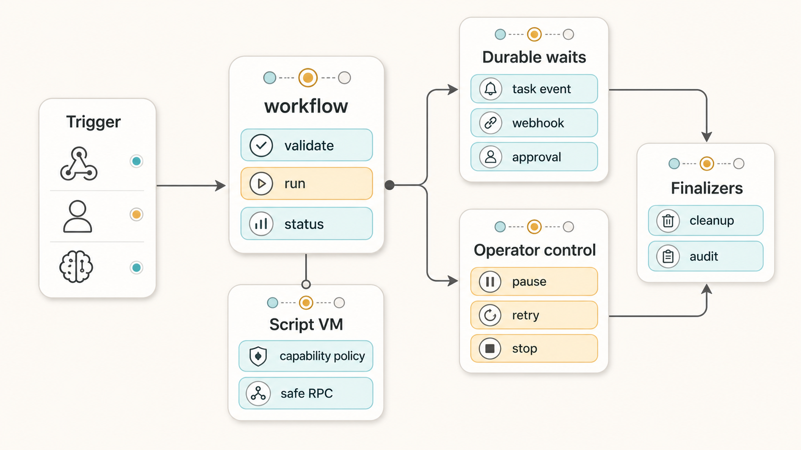

# hermes-plugin-dynamic-workflows

> **Turn “go do this multi-step agent thing” into a resumable, inspectable workflow.**
>
> Dynamic Workflows gives Hermes Agent a `workflow` authoring tool plus a
> `workflow_control` operator tool for validating, running, pausing, resuming, and
> inspecting agent workflows made of deterministic steps, durable waits, event
> wakeups, guarded script harnesses, scoped grants, and cleanup finalizers.



**Current release line:** `0.1.0` — the first semantic-versioned public alpha.

This is for people building agent systems where “just call another agent” stops being enough:
release lanes, QA/review gates, issue lifecycle automation, long-running investigations,
operator-approved actions, and any flow that needs to survive pauses, restarts, blocked waits,
or external webhook events without turning into a cron-polled swamp.

## Why use it?

Most agent orchestration fails in the boring middle: a child task blocks, a review arrives later,
a webhook fires while the process is asleep, or an operator needs to pause/retry one branch without
losing the whole run. Dynamic Workflows makes that middle explicit.

| Pain | Dynamic Workflows gives you |
| --- | --- |
| Agents re-plan the same phase every time a timer wakes up. | One durable run with explicit phases, waits, and resumable status. |
| “Did the QA/review/fix branch finish?” lives in chat scrollback. | Structured run snapshots, compact journals, and `workflow_control status`. |
| Model-authored automation wants too much authority. | A subprocess script VM where every effect crosses a parent-owned capability policy. |
| Webhooks and external events arrive outside the agent turn. | A backend-neutral event broker with idempotent event ids and versioned waits. |
| Cleanup gets forgotten after success/failure/timeout. | Resource finalizers for host-owned adapters such as listeners, sessions, processes, and temp workspaces. |

## What you can build

- **Release validation lanes** — start from a PR/opened or PR/synchronized event, fan out QA and review,
  wait for terminal results, then produce one exact-head release recommendation.
- **Issue lifecycle workflows** — load an issue once, plan a slice, dispatch implementation/review/QA tasks,
  loop on fix attempts, and hand off only when the evidence is current.
- **Human-approved actuator loops** — run sensors/verifiers repeatedly, request scoped session grants for
  side-effecting actions, and halt safely when approvals, budgets, or brakes fail.
- **Reusable workflow-script harnesses** — save versioned Python harnesses that call `agent`, `kanban_agent`,
  `capability`, `parallel`, `pipeline`, `phase`, and `workflow` through the guarded VM.
- **Operator-visible long runs** — list active/recent runs, blocked waits, pause/resume/stop intents, retry
  lineage, and cleanup outcomes without asking a model to reconstruct state from vibes.

## The 30-second mental model

```text
trigger / operator / model
          │
          ▼
  workflow(validate/run/status/catalog/script)
          │
          ├─ declarative JSON steps: agent · kanban_agent · if · parallel · pipeline · phase
          ├─ script harness VM: safe globals + parent-owned RPC capabilities
          ├─ durable waits: task-board events, webhook events, approval requests
          ├─ workflow_control: pause · resume · stop · task_stop · retry
          └─ finalizers: cleanup host-owned resources on success/failure/timeout
```

The core package stays deliberately small: Python 3.11 stdlib, no runtime dependencies, no direct
network authority, and no hidden shell escape. Real side effects belong to host adapters and injected
capabilities, not to workflow definitions.

## Status and compatibility

`0.1.0` is a public alpha, not a production multi-tenant sandbox. The release is useful for local
Hermes plugin experiments, library integration, workflow-shape design, tests, and adapter prototyping.
Do **not** treat it as a hardened boundary for arbitrary untrusted users yet.

| Area | Status in `0.1.0` |
| --- | --- |
| Python package | Pure Python 3.11 stdlib runtime; `pytest` is dev-only. |
| Hermes plugin | Root `plugin.yaml` + `__init__.py::register(ctx)` for profile-local plugin installs. |
| Workflow definitions | Declarative JSON; no YAML dependency; no direct filesystem/network authority. |
| Script harnesses | Python subprocess VM with restricted builtins and parent-owned RPC capability broker. |
| Event wakeups | Local file/in-memory event stores plus notifier seams; production multi-host stores are host adapter work. |
| Operator controls | Append-only pause/resume/stop/task_stop/retry records and compact status projections. |
| Security posture | Default-deny design and credential redaction, but not a hardened untrusted-code boundary yet. |

Version anchors already agree on `0.1.0`:

- `pyproject.toml` → `[project].version`
- `plugin.yaml` → `version`
- `hermes_workflows.__version__`

See [CHANGELOG.md](CHANGELOG.md) and [docs/release/v0.1.0.md](docs/release/v0.1.0.md) for release notes,
known limits, and the exact checks to run before tagging `v0.1.0`.

## Quick start as a Python package

```bash
git clone https://github.com/donovan-yohan/hermes-plugin-dynamic-workflows.git
cd hermes-plugin-dynamic-workflows

# optional, but keeps the environment isolated
uv venv
source .venv/bin/activate

# install editable package + pytest convenience runner
uv pip install -e ".[dev]"

# run tests
pytest -q
```

Run the bundled hello workflow through the library primitives:

```bash
python3 - <<'PY'
import json
from hermes_workflows.primitives import workflow_validate, workflow_run, workflow_status

with open("examples/hello.workflow.json") as f:
    definition = json.load(f)

validation = workflow_validate(definition)
print("validate:", validation.ok, "errors:", len(validation.errors))

handle = workflow_run(definition, inputs={"name": "world"})
print("run:", handle.run_id, handle.status)

status = workflow_status(handle.run_id)
print("status:", status.status, status.progress.pct)
for step in status.steps:
    print(step.step_id, step.output)
PY
```

Expected output includes:

```text
validate: True errors: 0
run: wf_<hash>_<id> succeeded
status: succeeded 100.0
greet {'greeting': 'hello, world'}
shout {'result': 'HELLO, WORLD'}
```

## Install as a Hermes plugin

Hermes user plugins live under `$HERMES_HOME/plugins/<plugin-name>/`.
For a normal profile this is usually `~/.hermes/plugins/`; for a named profile it is
`~/.hermes/profiles/<profile>/plugins/`.

```bash
# from this repo checkout
export HERMES_HOME="${HERMES_HOME:-$HOME/.hermes}"
mkdir -p "$HERMES_HOME/plugins"
ln -s "$PWD" "$HERMES_HOME/plugins/hermes-dynamic-workflows"

# restart Hermes / gateway so plugin discovery reloads
hermes plugins list
```

The plugin registers tools in the `dynamic_workflows` toolset:

| Tool | Purpose |
| --- | --- |
| `workflow` | Model-facing facade for validate/run/status/catalog/script operations. |
| `workflow_control` | Operator surface for overview/status/pause/resume/stop/task_stop/retry. |

The shipped `workflow` tool currently exposes saved-script operations with
snake_case parameters: `script_source` for `script_save`, `script_name` for
`script_inspect` / `run_script`, `script_args` for runtime inputs, and
`script_version` for selecting a saved version. CamelCase
archive aliases such as `scriptPath` or `resumeFromRunId` are not part of the
registered Hermes tool schema in `0.1.0`.

If Hermes does not show `workflow` after restart, check:

1. the symlink points at this repo root, not `src/`
2. `plugin.yaml` is present at the plugin root
3. root `__init__.py` imports cleanly
4. the relevant Hermes session has the plugin/toolset enabled

## Example workflow definition

`examples/hello.workflow.json` wires a greeter agent into an uppercaser agent:

```json
{
  "version": "1",
  "name": "hello",
  "inputs": { "name": "string" },
  "policy": {
    "network": false,
    "filesystem": false,
    "max_parallel": 2,
    "max_agent_calls": 8,
    "max_kanban_cards": 3,
    "max_active_awaits": 2,
    "allowed_profiles": ["qa", "reviewer"]
  },
  "steps": [
    {
      "kind": "agent",
      "id": "greet",
      "agent": "hermes.greeter",
      "input": { "subject": "$ref:inputs.name" },
      "output_schema": { "greeting": "string" }
    },
    {
      "kind": "agent",
      "id": "shout",
      "agent": "hermes.uppercaser",
      "input": { "text": "$ref:greet.output.greeting" },
      "output_schema": { "result": "string" },
      "depends_on": ["greet"]
    }
  ]
}
```

Workflow definitions are data, not code. The runtime interprets the validated AST and routes all
agent effects through an injected `AgentRunner` boundary. `$ref:inputs.<key>` and
`$ref:<step>.output.<field>` wire data between steps.

Supported step kinds in `0.1.0`:

- `agent` — call an injected agent runner and validate structured output.
- `kanban_agent` — durable task-board awaitable contract, with in-memory/file/Hermes-backed adapters.
- `if` — deterministic branch selection.
- `parallel` — modeled fan-out with bounded width.
- `pipeline` — step output feeds the next step.
- `phase` — explicit barrier group.

## Script harnesses

Declarative JSON is best when the graph is known ahead of time. For reusable orchestration code,
`0.1.0` also ships a subprocess workflow-script VM and versioned script catalog.

A script can call safe globals such as `agent`, `kanban_agent`, `capability`, `parallel`, `pipeline`,
`phase`, `log`, and `workflow`. It cannot import arbitrary modules, read environment secrets, open the
network, or touch the filesystem directly. Any real effect must cross the parent-owned capability
broker, where the host decides names, side-effect classes, approval ids, redaction, output limits,
and replay/idempotency policy.

```python
from hermes_workflows.primitives import workflow

workflow(
    action="script_save",
    script_name="issue_lane",
    script_source='meta = {"name": "issue_lane", "description": "demo"}\nlog("start")\nreturn {"ok": True}\n',
)
workflow(action="script_catalog", include_versions=True)
workflow(action="run_script", script_name="issue_lane", script_args={"issue": 123})
```

See [examples/README.md](examples/README.md) for runnable script VM, scoped grant, and finalizer examples.

### Python-vs-JS workflow script compatibility boundary

Dynamic Workflows aims for parity with Claude-style workflow scripts at the **orchestration
primitive** level, not by executing the same source syntax today. Archive examples such as
`loop-until-dry-bughunt.js` use JavaScript (`export const meta`, async functions, and
`agent(prompt, { label, phase, schema })`). This plugin currently ships a guarded **Python**
workflow-script VM with the same product contract expressed through Python syntax and
parent-owned RPC calls.

Intended parity:

| Claude archive shape | Current Hermes Python harness |
| --- | --- |
| `export const meta = ...` | First statement must be literal `meta = {...}` with `name` and `description`; optional metadata such as `phases` is preserved. |
| `agent(...)` | `await agent(agent_id, input, label=..., schema=...)`; the host owns the real agent runner. |
| `parallel(...)` / `pipeline(...)` / `phase(...)` | `await parallel([...])`, `await pipeline(...)`, and `phase("title")` with deterministic, brokered execution. |
| `log(...)`, script inputs, and budget checks | `log(...)`, read-only `args`, and read-only `budget.remaining()` / `budget.spent()`. |
| Journal/cache/resume semantics | Stable call ids, metadata-only journals, deterministic replay cache, and durable Kanban reattach/resume where supported. |
| Facade entrypoints | Current `workflow` tool parameters are `script_source`, `script_name`, `script_args`, and `script_version`; declared `meta.phases` appear in script run status. CamelCase archive aliases are future compatibility vocabulary, not shipped schema. |

Intentional differences in `0.1.0`:

- JavaScript syntax is **future work** unless a separate JS guest runtime is added.
- Python scripts cannot use `import` / `from ... import`, direct filesystem access, direct network access,
  environment reads, process execution, clock/time APIs, randomness, `print`, or dynamic builtins such as
  `eval`, `exec`, `open`, `__import__`, `globals`, or `getattr`.
- Every outside effect must go through `agent`, `kanban_agent`, `capability`, `workflow`, `phase`, or `log`,
  where the parent process applies capability policy, redaction, output limits, replay/idempotency, and approvals.
- The subprocess environment is scrubbed; scripts receive only restricted builtins, safe `json` / `math` proxies,
  `args`, `budget`, `meta`, and the RPC-backed workflow globals.

Side-by-side translation of the archive's loop-until-dry shape:

```js
// Claude archive style — illustrative, not executed by this plugin today.
export const meta = { name: "loop-until-dry-bughunt" };

let round = 0;
let areas = ["runtime", "docs", "tests"];

while (areas.length && budget.remaining() > 0 && round < 4) {
  phase(`round ${round + 1}`);
  const results = await parallel(areas.map((area) =>
    agent(`Find remaining bugs in ${area}`, {
      label: `bughunt:${area}`,
      phase: "bughunt",
      schema: { bugs: "array", followups: "array" }
    })
  ));

  areas = results.flatMap((result) => result.followups ?? []);
  log(`round ${round + 1}: ${areas.length} follow-up areas`);
  round += 1;
}
```

```python
# Current Hermes harness shape — validated, then run in the guarded Python VM.
meta = {
    "name": "loop_until_dry_bughunt",
    "description": "Repeat bughunt passes until no follow-up areas remain",
    "phases": ["bughunt"],
}

round_index = 0
script_args = args or {}
areas = list(script_args.get("areas", ["runtime", "docs", "tests"]))
max_rounds = script_args.get("max_rounds", 4)


async def scan(area):
    return await agent(
        "hermes.bughunter",
        {"prompt": f"Find remaining bugs in {area}", "area": area},
        label=f"bughunt:{area}",
        schema={"bugs": "list", "followups": "list"},
    )


while areas and budget.remaining() > 0 and round_index < max_rounds:
    phase(f"round {round_index + 1}")
    results = await parallel([lambda area=area: scan(area) for area in areas])

    next_areas = []
    for result in results:
        for followup in result.get("followups", []):
            if followup not in next_areas:
                next_areas.append(followup)
    areas = next_areas
    log(f"round {round_index + 1}: {len(areas)} follow-up areas")
    round_index = round_index + 1

return {"remaining_areas": areas, "rounds": round_index}
```

The archive-parity regression under `tests/fixtures/loop_until_dry/` is intentionally
deterministic. It uses a sanitized `cart.js` subject file plus `fake_child_responses.json`
instead of replaying the original Claude transcript or contacting live agents. That fixture
proves the runtime topology: round loop, three concurrent finder child agents, candidate
deduplication, N verifier child agents, dry-counter termination, max-round fallback, progress
rows, and prompt/options fingerprint resume. A live-agent smoke can reuse the same Python
harness by injecting a real `child_agent_runner`, but live findings are expected to diverge
from the fake fixture and should be treated as optional smoke evidence rather than a stable
unit-test oracle.

## Event-driven workflows, not timer-owned phase control

The big rule: **cron may start a workflow, but cron should not own workflow phase control**.

A timer watchdog that wakes every few minutes, polls the world, reconstructs “what phase are we in?”,
and asks an agent to rediscover the next step creates duplicate work and stale context. Prefer one
workflow run per goal: the trigger payload seeds the run, agent/task-board waits park between phases,
and webhook or task events resume the run from durable state.

Use cron only for calendar starts, visibility heartbeats, or simple script-only pings. Use workflow
events and waits for goal-directed advancement.

## Security model

The package tries to make authority boundaries boring and explicit:

- Workflow definitions are JSON and are never `eval()`ed.
- The JSON runtime has no direct network or filesystem authority.
- Script harnesses run out-of-process behind restricted builtins and a scrubbed environment.
- Capability calls are host-registered by name and side-effect class.
- Mutating capability classes require explicit approval ids when the host policy says so.
- Credential-shaped inputs, labels, summaries, stdout/stderr, errors, and capability outputs are rejected
  or redacted at the parent boundary.
- Run state is parent-owned: snapshots and compact journals, not child transcript sludge.
- Operator controls are append-only intent records; adapters still own actual cancellation/replay behavior.

Still, `0.1.0` is **not** a final sandbox for arbitrary hostile users. Treat it as an alpha substrate for
trusted local/plugin experiments and host-adapter development.

## Development

```bash
# compile
python3 -m compileall -q __init__.py src/hermes_workflows tests

# stdlib unittest bridge
PYTHONPATH=src python3 -m unittest discover -s tests -v

# pytest convenience runner
uv run --extra dev pytest -q

# package build
uv build
```

The repo intentionally avoids runtime dependencies. `pytest` is only a dev convenience.

## Project map

| Path | What lives there |
| --- | --- |
| `plugin.yaml` / root `__init__.py` | Hermes plugin entrypoint. |
| `src/hermes_workflows/primitives.py` | Public library/tool facade. |
| `src/hermes_workflows/runtime.py` | Deterministic JSON workflow interpreter. |
| `src/hermes_workflows/vm.py` / `vm_guest.py` | Subprocess workflow-script VM. |
| `src/hermes_workflows/capabilities.py` | Host-owned capability registry and policy. |
| `src/hermes_workflows/events.py` | Durable workflow event broker. |
| `src/hermes_workflows/loops.py` | Feedback-controller loop runtime. |
| `src/hermes_workflows/controls.py` | Operator control projections and decisions. |
| `src/hermes_workflows/resources.py` | Resource declarations and finalizer registry. |
| `examples/` | Runnable workflow and script examples. |
| `DESIGN.md` | Detailed architecture notes and implementation rationale. |

## Current limitations

- `parallel` is modeled with deterministic joins; true concurrent execution belongs to host adapters.
- Event and run stores are local/in-memory/file oriented by default; multi-host production needs a shared adapter.
- The default `StubAgentRunner` only simulates demo agents.
- The script VM can replay completed deterministic RPC calls, but general partial-run resume is still evolving.
- Gateway, CI, task-board, and session-control integrations must be verified in the host that owns those adapters.

## Links

- [DESIGN.md](DESIGN.md) — architecture, safety model, and component notes.
- [examples/README.md](examples/README.md) — runnable examples.
- [docs/release/v0.1.0.md](docs/release/v0.1.0.md) — release notes and tagging checklist.
- [Hermes plugin docs](https://hermes-agent.nousresearch.com/docs/user-guide/features/plugins) — plugin discovery and registration.
- [Build a Hermes Plugin](https://hermes-agent.nousresearch.com/docs/guides/build-a-hermes-plugin) — full Hermes plugin guide.

## License

MIT — see [LICENSE](LICENSE).
