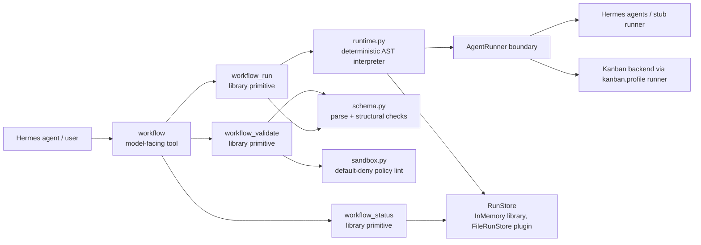
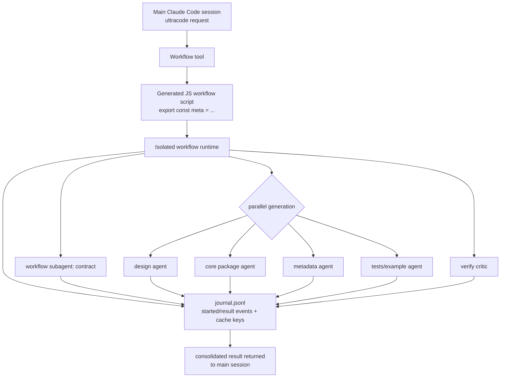
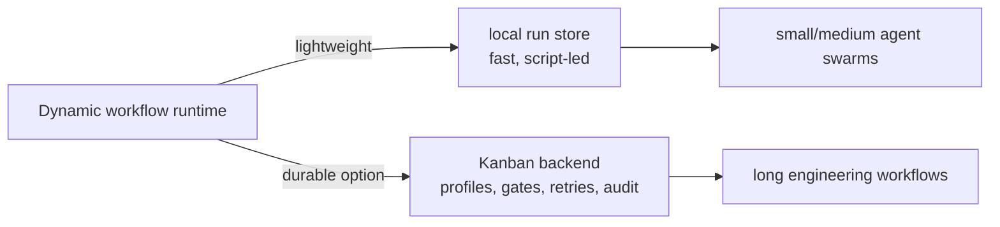

# hermes-plugin-dynamic-workflows

A prototype Hermes Agent plugin for **Claude Code–style dynamic workflows**: a lightweight,
sandboxed orchestration runtime where an agent can validate, run, and inspect workflow definitions
made of `agent`, `kanban_agent`, `if`, `parallel`, `pipeline`, and `phase` steps.

The product-shaped surface is now the single model-facing `workflow` tool: validate with `dry_run`,
run with a workflow definition, or inspect an existing run with `run_id`. The lower-level
`workflow_validate`, `workflow_run`, and `workflow_status` functions remain as explicit
library/debug/operator primitives.

This repo is intentionally small: pure Python 3.11 stdlib, no runtime dependencies, no network, and
no generated-code execution. Workflow definitions are declarative JSON and all real work crosses one
explicit `AgentRunner` boundary; parent-owned persistence writes only run snapshots and compact
journal events.

> status: research/prototype scaffold. useful for modeling the plugin surface and runtime shape;
> not a production sandbox yet.

## What this provides

| Surface | Purpose |
| --- | --- |
| `workflow` tool | Single model-facing entry point: dry-run validate, run a definition, or inspect an existing run id. |
| `workflow_validate` function | Parse and statically validate a workflow definition without side effects. |
| `workflow_run` function | Execute a validated workflow in the deterministic skeleton runtime. |
| `workflow_status` function | Query status/progress/result for a workflow run id. |

The current runtime supports:

- declarative JSON workflow definitions
- `$ref:inputs.<key>` and `$ref:<step>.output.<field>` data wiring
- deterministic `agent` / `kanban_agent` / `if` / `parallel` / `pipeline` / `phase` composition
- declarative saved workflow templates via catalog listing and `run_template`
- flat structured-output schema checks
- default-deny sandbox policy linting
- in-memory run storage for library use
- parent-owned filesystem run storage for plugin use: `snapshot.json` + compact `journal.jsonl`
- a Hermes plugin entrypoint: `plugin.yaml` + root `__init__.py::register(ctx)`
- a subprocess **workflow script VM**: run model-authored Python orchestration scripts out-of-process under a static launch gate, scrubbed env, restricted builtins, and a parent-owned RPC capability broker (library/operator primitives `workflow_validate_script` / `run_workflow_script`; not model-facing)

## Quick start as a Python package

```bash
git clone https://github.com/donovan-yohan/hermes-plugin-dynamic-workflows.git
cd hermes-plugin-dynamic-workflows

# optional, but keeps the environment isolated
uv venv
source .venv/bin/activate

# install editable package + pytest convenience runner
uv pip install -e ".[dev]"

# run tests
pytest -q

# run the bundled example through the primitives
PYTHONPATH=src python3 - <<'PY'
import json
from hermes_workflows.primitives import workflow_validate, workflow_run, workflow_status

with open("examples/hello.workflow.json") as f:
    definition = json.load(f)

validation = workflow_validate(definition)
print("validate:", validation.ok, "errors:", len(validation.errors))

handle = workflow_run(definition, inputs={"name": "world"})
print("run:", handle.run_id, handle.status)

status = workflow_status(handle.run_id)
print("status:", status.status, status.progress.pct)
for step in status.steps:
    print(step.step_id, step.output)
PY
```

Expected output includes:

```text
validate: True errors: 0
run: wf_<hash>_<id> succeeded
status: succeeded 100.0
greet {'greeting': 'hello, world'}
shout {'result': 'HELLO, WORLD'}
```

## Install as a Hermes plugin

Hermes user plugins live under `$HERMES_HOME/plugins/<plugin-name>/`.
For a normal profile this is usually `~/.hermes/plugins/`; for a named profile it is
`~/.hermes/profiles/<profile>/plugins/`.

```bash
# from this repo checkout
export HERMES_HOME="${HERMES_HOME:-$HOME/.hermes}"
mkdir -p "$HERMES_HOME/plugins"
ln -s "$PWD" "$HERMES_HOME/plugins/hermes-dynamic-workflows"

# restart Hermes / gateway so plugin discovery reloads
hermes plugins list
```

The plugin registers this tool in the `dynamic_workflows` toolset:

- `workflow` — the single model-facing entry point
  - `action: "validate"` / `dry_run: true` validates a supplied definition.
  - `action: "run"` runs a supplied definition.
  - `action: "status"` reads a prior `run_id`.
  - `action: "catalog"` lists saved templates from bundled examples and `$HERMES_WORKFLOWS_CATALOG_DIR` or `$HERMES_HOME/dynamic-workflows/templates`.
  - `action: "run_template"` loads a safe `<name>.workflow.json` template and runs it; `template_name` alone also infers `run_template`.

The lower-level `workflow_validate`, `workflow_run`, and `workflow_status` functions remain available
for tests, library callers, and operator/debug integrations, but they are not registered as
model-facing Hermes tools by default.

If Hermes does not show `workflow` after restart, check:

1. the symlink points at this repo root, not `src/`
2. `plugin.yaml` is present at the plugin root
3. root `__init__.py` imports cleanly
4. the relevant Hermes session has the plugin/toolset enabled

## Example workflow definition

`examples/hello.workflow.json` wires a greeter agent into an uppercaser agent:

```json
{
  "version": "1",
  "name": "hello",
  "inputs": { "name": "string" },
  "policy": { "network": false, "filesystem": false, "max_parallel": 2 },
  "steps": [
    {
      "kind": "agent",
      "id": "greet",
      "agent": "hermes.greeter",
      "input": { "subject": "$ref:inputs.name" },
      "output_schema": { "greeting": "string" }
    },
    {
      "kind": "agent",
      "id": "shout",
      "agent": "hermes.uppercaser",
      "input": { "text": "$ref:greet.output.greeting" },
      "output_schema": { "result": "string" },
      "depends_on": ["greet"]
    }
  ]
}
```

### Conditional control flow

`if` steps evaluate a deterministic condition and expose only the container output to later steps.
Branch-local step ids do not leak outside the selected branch; downstream steps should reference
`$ref:<if_step>.output.branch` or `$ref:<if_step>.output.output`.

```json
{
  "kind": "if",
  "id": "needs_fix",
  "condition": { "ref": "$ref:qa_gate.output.passed", "op": "eq", "value": false },
  "then": [
    { "kind": "agent", "id": "fix", "agent": "hermes.echo", "input": { "mode": "fix" }, "output_schema": { "echo": "object" } }
  ],
  "else": [
    { "kind": "agent", "id": "ship", "agent": "hermes.echo", "input": { "mode": "ship" }, "output_schema": { "echo": "object" } }
  ]
}
```

Supported condition operators are `truthy`, `exists`, `eq`, and `ne`.

### Kanban-backed awaitable step

`kanban_agent` is the durable-backend contract. The skeleton does not call Kanban directly; it
normalizes the step into the reserved runner id `kanban.<profile>`. A production runner can bind that
id to a Hermes Kanban board/profile, persist the task id, and wake the workflow from task events.

```json
{
  "kind": "kanban_agent",
  "id": "plan_issue",
  "profile": "relayplanner",
  "task": { "issue": "$ref:inputs.issue", "goal": "triage and plan" },
  "input": { "repo": "donovan-yohan/relay-ide" },
  "output_schema": { "task_id": "string", "status": "string", "result": "object" }
}
```

This is the first replacement seam for timer watchdog orchestration: workflows await a durable task
result instead of polling status just to decide the next step. The current stub runner returns a
deterministic `kb_<hash>` task id for tests.

## Script-led subprocess VM (issue #2)

Alongside the declarative JSON runtime, the plugin can run a **Python workflow
script** — a deterministic orchestration brain in the Claude Dynamic Workflows
shape — in a sandboxed subprocess. The script is real code, so it never executes
inside the parent process: the parent statically validates it as a launch gate,
runs it under `python -m hermes_workflows.vm_guest` with a scrubbed environment
(no Hermes/GitHub credentials), and brokers every capability the script reaches
for over a narrow stdio RPC channel.

```python
from hermes_workflows import run_workflow_script

script = '''
meta = {"name": "demo", "description": "greet then shout"}
log("starting")
g = await agent("hermes.greeter", {"subject": args["who"]}, schema={"greeting": "string"})
s = await agent("hermes.uppercaser", {"text": g["greeting"]})
phase("done")
return {"shout": s["result"]}
'''

result = run_workflow_script(script, args={"who": "world"})
print(result.ok, result.value)          # True {'shout': 'HELLO, WORLD'}
print([(c["method"], c["call_id"]) for c in result.calls])
# [('log', 1), ('agent', 2), ('agent', 3), ('phase', 4)]
```

Scripts may use deterministic control flow (`if`/`for`/`while`/`try`,
functions, comprehensions, `async`/`await`) and the RPC-backed globals `agent`,
`kanban_agent`, `parallel`, `pipeline`, `phase`, `log`, `workflow`, plus `args`
and `budget` and the pre-bound deterministic `json` / `math`. They may **not**
`import`, touch the filesystem/network/process/env/clock/randomness, traverse
dunder attributes, or call `eval`/`exec`/`open` — all rejected by
`workflow_validate_script` before launch (and again, defensively, inside the
guest). The parent broker enforces a method allow-list, the known-agent
registry, output schemas, and `VMLimits` (`max_rpc_calls`, `max_agent_calls`,
`max_kanban_calls`, `max_runtime_s`, `token_budget`). A subprocess crash or
timeout marks the run failed without corrupting parent state. See
[DESIGN.md §5](DESIGN.md) for the security model.

This surface is intentionally a library/operator primitive: the single
model-facing `workflow` tool and the JSON runtime are unchanged.

## Saved workflow catalog

Templates are JSON workflow files named `<template>.workflow.json`. The default catalog searches the
bundled `examples/` directory plus `$HERMES_WORKFLOWS_CATALOG_DIR` when set, otherwise
`$HERMES_HOME/dynamic-workflows/templates`. Template names are single safe path segments; path
traversal and symlink escapes are rejected/skipped.

```python
from hermes_workflows.primitives import workflow

print(workflow(action="catalog"))
print(workflow(template_name="hello", inputs={"name": "world"}))
```

The bundled `relay_github_exact_head` template is an offline contract fixture for Relay-style PR
gates: it captures the PR head once, passes that exact SHA through QA/review steps, and only allows
the release decision to succeed when QA/review evidence matches the same head.

## Architecture at a glance



## What we learned from Claude Dynamic Workflows

This prototype was scaffolded after dogfooding Claude Code `ultracode` / Dynamic Workflows.
The observed product shape is roughly:



Observed details from the scaffold run:

- inline workflow scripts start with `export const meta = { name, description, phases }`
- orchestration uses `phase(...)`, `agent(...)`, and `parallel([...])`
- agent outputs can be schema-constrained
- ad-hoc generated scripts may be persisted under Claude's per-project state, not committed to repo
- runtime state includes `journal.jsonl`, `agent-*.jsonl`, and small `agent-*.meta.json` files
- the journal records `started` / `result` events keyed by cache-like `v2:<hash>` identifiers
- the main session receives a consolidated final result, not every intermediate transcript

More detail:

- [DESIGN.md](DESIGN.md) — plugin architecture, sandbox model, Hermes/Kanban design choices
- [docs/claude-dynamic-workflows-observations.md](docs/claude-dynamic-workflows-observations.md) — empirical notes and diagrams from the Claude Code run
- [Claude Code workflows docs](https://code.claude.com/docs/en/workflows) — official upstream reference
- [Claude Code TypeScript SDK docs](https://code.claude.com/docs/en/agent-sdk/typescript) — `Workflow` tool shape
- [Hermes plugin docs](https://hermes-agent.nousresearch.com/docs/user-guide/features/plugins) — plugin discovery and registration
- [Build a Hermes Plugin](https://hermes-agent.nousresearch.com/docs/guides/build-a-hermes-plugin) — full Hermes plugin guide

## Why not just Kanban?

Kanban is still useful, but it solves a heavier problem: durable multi-profile engineering work,
retries, gates, audit trails, named workers, and long-running task boards.

This plugin explores the lighter gap: **script-led orchestration outside chat context**. The workflow
script coordinates; child agents do the real work under normal Hermes permissions.



## Development

```bash
# compile
python3 -m compileall -q __init__.py src/hermes_workflows tests

# stdlib unittest bridge
PYTHONPATH=src python3 -m unittest discover -s tests -v

# pytest convenience runner
uv run --with pytest pytest -q
```

The repo intentionally avoids runtime dependencies. `pytest` is only a dev convenience.

## Current limitations

- The runtime is synchronous and deterministic; `parallel` is modeled, not truly concurrent (true in both the JSON runtime and the subprocess VM's guest combinators).
- The JSON runtime's sandbox is a declarative policy checker, not a code VM. The subprocess VM (issue #2) does run code, but only out-of-process behind a static gate + restricted builtins + parent RPC broker.
- The default `StubAgentRunner` only simulates known demo agents.
- No durable resume/replay yet; the `RunStore` shape and the VM's stable RPC call ids are designed to grow into it (issue #3).
- The Kanban backend is documented/stubbed, not implemented.
- The subprocess VM is the smallest coherent issue #2 slice: durable script journals/replay (#3), the full script API with loop guards (#4), and launch-approval/session-policy governance (#11) are deferred.

## License

MIT. See [LICENSE](LICENSE).
