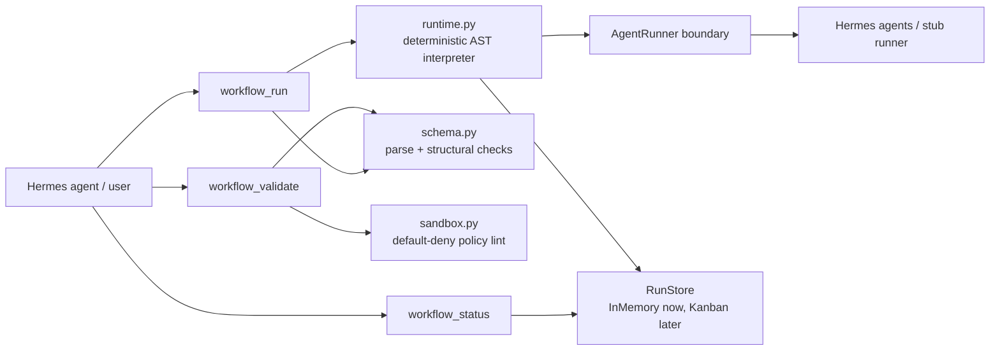
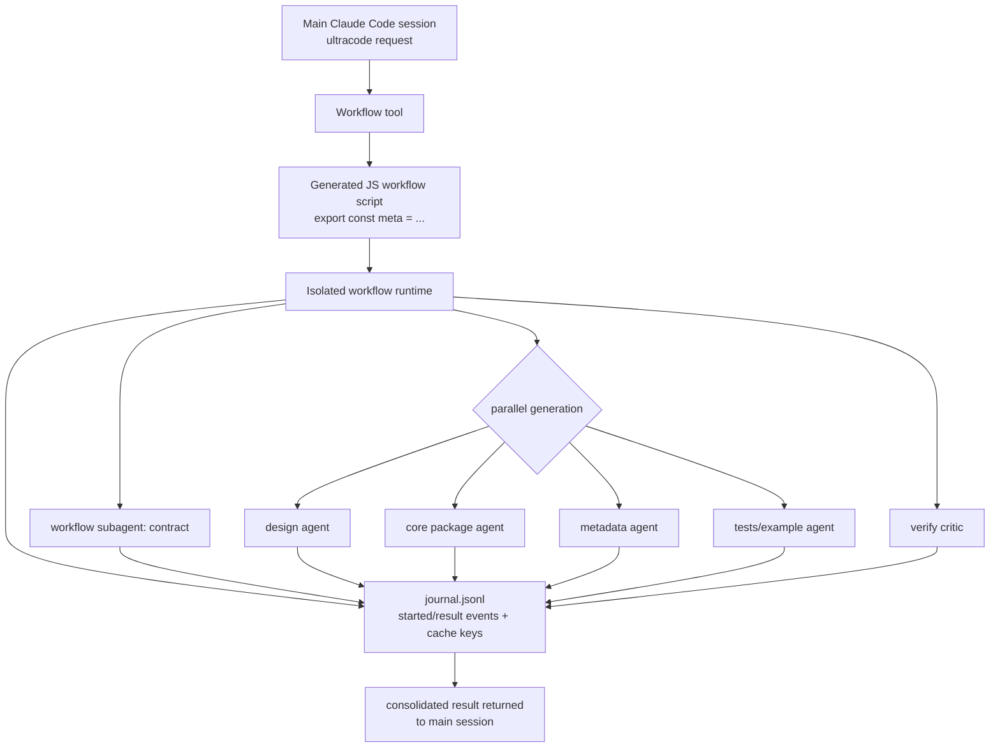
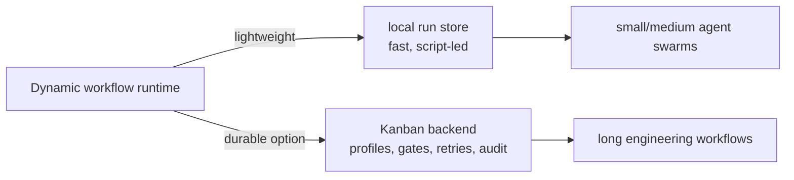

# hermes-plugin-dynamic-workflows

A prototype Hermes Agent plugin for **Claude Code–style dynamic workflows**: a lightweight,
sandboxed orchestration runtime where an agent can validate, run, and inspect workflow definitions
made of `agent`, `parallel`, `pipeline`, and `phase` steps.

This repo is intentionally small: pure Python 3.11 stdlib, no runtime dependencies, no network, and
no generated-code execution. Workflow definitions are declarative JSON and all real work crosses one
explicit `AgentRunner` boundary.

> status: research/prototype scaffold. useful for modeling the plugin surface and runtime shape;
> not a production sandbox yet.

## What this provides

| Tool | Purpose |
| --- | --- |
| `workflow_validate` | Parse and statically validate a workflow definition without side effects. |
| `workflow_run` | Execute a validated workflow in the deterministic skeleton runtime. |
| `workflow_status` | Query status/progress/result for a workflow run id. |

The current runtime supports:

- declarative JSON workflow definitions
- `$ref:inputs.<key>` and `$ref:<step>.output.<field>` data wiring
- deterministic `agent` / `parallel` / `pipeline` / `phase` composition
- flat structured-output schema checks
- default-deny sandbox policy linting
- in-memory run storage, with a documented Kanban backend option
- a Hermes plugin entrypoint: `plugin.yaml` + root `__init__.py::register(ctx)`

## Quick start as a Python package

```bash
git clone https://github.com/donovan-yohan/hermes-plugin-dynamic-workflows.git
cd hermes-plugin-dynamic-workflows

# optional, but keeps the environment isolated
uv venv
source .venv/bin/activate

# install editable package + pytest convenience runner
uv pip install -e ".[dev]"

# run tests
pytest -q

# run the bundled example through the primitives
PYTHONPATH=src python3 - <<'PY'
import json
from hermes_workflows.primitives import workflow_validate, workflow_run, workflow_status

with open("examples/hello.workflow.json") as f:
    definition = json.load(f)

validation = workflow_validate(definition)
print("validate:", validation.ok, "errors:", len(validation.errors))

handle = workflow_run(definition, inputs={"name": "world"})
print("run:", handle.run_id, handle.status)

status = workflow_status(handle.run_id)
print("status:", status.status, status.progress.pct)
for step in status.steps:
    print(step.step_id, step.output)
PY
```

Expected output includes:

```text
validate: True errors: 0
run: wf_<hash>_<id> succeeded
status: succeeded 100.0
greet {'greeting': 'hello, world'}
shout {'result': 'HELLO, WORLD'}
```

## Install as a Hermes plugin

Hermes user plugins live under `$HERMES_HOME/plugins/<plugin-name>/`.
For a normal profile this is usually `~/.hermes/plugins/`; for a named profile it is
`~/.hermes/profiles/<profile>/plugins/`.

```bash
# from this repo checkout
export HERMES_HOME="${HERMES_HOME:-$HOME/.hermes}"
mkdir -p "$HERMES_HOME/plugins"
ln -s "$PWD" "$HERMES_HOME/plugins/hermes-dynamic-workflows"

# restart Hermes / gateway so plugin discovery reloads
hermes plugins list
```

The plugin registers these tools in the `dynamic_workflows` toolset:

- `workflow_validate`
- `workflow_run`
- `workflow_status`

If Hermes does not show them after restart, check:

1. the symlink points at this repo root, not `src/`
2. `plugin.yaml` is present at the plugin root
3. root `__init__.py` imports cleanly
4. the relevant Hermes session has the plugin/toolset enabled

## Example workflow definition

`examples/hello.workflow.json` wires a greeter agent into an uppercaser agent:

```json
{
  "version": "1",
  "name": "hello",
  "inputs": { "name": "string" },
  "policy": { "network": false, "filesystem": false, "max_parallel": 2 },
  "steps": [
    {
      "kind": "agent",
      "id": "greet",
      "agent": "hermes.greeter",
      "input": { "subject": "$ref:inputs.name" },
      "output_schema": { "greeting": "string" }
    },
    {
      "kind": "agent",
      "id": "shout",
      "agent": "hermes.uppercaser",
      "input": { "text": "$ref:greet.output.greeting" },
      "output_schema": { "result": "string" },
      "depends_on": ["greet"]
    }
  ]
}
```

## Architecture at a glance



## What we learned from Claude Dynamic Workflows

This prototype was scaffolded after dogfooding Claude Code `ultracode` / Dynamic Workflows.
The observed product shape is roughly:



Observed details from the scaffold run:

- inline workflow scripts start with `export const meta = { name, description, phases }`
- orchestration uses `phase(...)`, `agent(...)`, and `parallel([...])`
- agent outputs can be schema-constrained
- ad-hoc generated scripts may be persisted under Claude's per-project state, not committed to repo
- runtime state includes `journal.jsonl`, `agent-*.jsonl`, and small `agent-*.meta.json` files
- the journal records `started` / `result` events keyed by cache-like `v2:<hash>` identifiers
- the main session receives a consolidated final result, not every intermediate transcript

More detail:

- [DESIGN.md](DESIGN.md) — plugin architecture, sandbox model, Hermes/Kanban design choices
- [docs/claude-dynamic-workflows-observations.md](docs/claude-dynamic-workflows-observations.md) — empirical notes and diagrams from the Claude Code run
- [Claude Code workflows docs](https://code.claude.com/docs/en/workflows) — official upstream reference
- [Claude Code TypeScript SDK docs](https://code.claude.com/docs/en/agent-sdk/typescript) — `Workflow` tool shape
- [Hermes plugin docs](https://hermes-agent.nousresearch.com/docs/user-guide/features/plugins) — plugin discovery and registration
- [Build a Hermes Plugin](https://hermes-agent.nousresearch.com/docs/guides/build-a-hermes-plugin) — full Hermes plugin guide

## Why not just Kanban?

Kanban is still useful, but it solves a heavier problem: durable multi-profile engineering work,
retries, gates, audit trails, named workers, and long-running task boards.

This plugin explores the lighter gap: **script-led orchestration outside chat context**. The workflow
script coordinates; child agents do the real work under normal Hermes permissions.



## Development

```bash
# compile
python3 -m compileall -q __init__.py src/hermes_workflows tests

# stdlib unittest bridge
PYTHONPATH=src python3 -m unittest discover -s tests -v

# pytest convenience runner
uv run --with pytest pytest -q
```

The repo intentionally avoids runtime dependencies. `pytest` is only a dev convenience.

## Current limitations

- The runtime is synchronous and deterministic; `parallel` is modeled, not truly concurrent.
- The sandbox is a declarative policy checker, not a JS VM.
- The default `StubAgentRunner` only simulates known demo agents.
- No durable resume/replay yet; the `RunStore` shape is designed to grow into it.
- The Kanban backend is documented/stubbed, not implemented.

## License

MIT. See [LICENSE](LICENSE).
