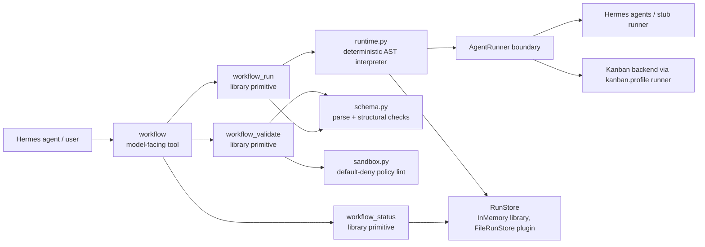
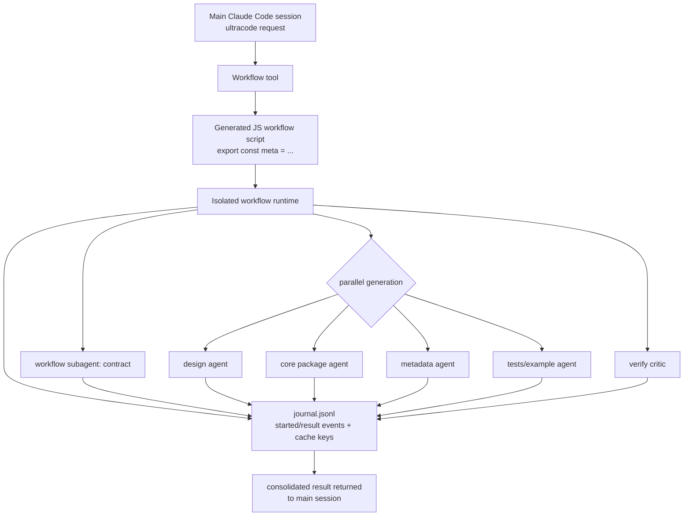
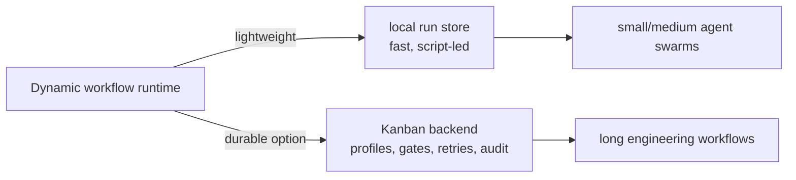

# hermes-plugin-dynamic-workflows

A prototype Hermes Agent plugin for **Claude Code–style dynamic workflows**: a lightweight,
sandboxed orchestration runtime where an agent can validate, run, and inspect workflow definitions
made of `agent`, `kanban_agent`, `if`, `parallel`, `pipeline`, and `phase` steps.

The product-shaped surface is now the single model-facing `workflow` tool: validate with `dry_run`,
run with a workflow definition, or inspect an existing run with `run_id`. The lower-level
`workflow_validate`, `workflow_run`, and `workflow_status` functions remain as explicit
library/debug/operator primitives.

This repo is intentionally small: pure Python 3.11 stdlib, no runtime dependencies, no network, and
no generated-code execution. Workflow definitions are declarative JSON and all real work crosses one
explicit `AgentRunner` boundary; parent-owned persistence writes only run snapshots and compact
journal events.

> status: research/prototype scaffold. useful for modeling the plugin surface and runtime shape;
> not a production sandbox yet.

## What this provides

| Surface | Purpose |
| --- | --- |
| `workflow` tool | Single model-facing entry point: dry-run validate, run a definition, or inspect an existing run id. |
| `workflow_validate` function | Parse and statically validate a workflow definition without side effects. |
| `workflow_run` function | Execute a validated workflow in the deterministic skeleton runtime. |
| `workflow_status` function | Query status/progress/result for a workflow run id. |

The current runtime supports:

- declarative JSON workflow definitions
- `$ref:inputs.<key>` and `$ref:<step>.output.<field>` data wiring
- deterministic `agent` / `kanban_agent` / `if` / `parallel` / `pipeline` / `phase` composition
- declarative saved workflow templates via catalog listing and `run_template`
- flat structured-output schema checks
- default-deny sandbox policy linting
- in-memory run storage for library use
- parent-owned filesystem run storage for plugin use: `snapshot.json` + compact `journal.jsonl`
- a Hermes plugin entrypoint: `plugin.yaml` + root `__init__.py::register(ctx)`
- a subprocess **workflow script VM**: run model-authored Python orchestration scripts out-of-process under a static launch gate, scrubbed env, restricted builtins, and a parent-owned RPC capability broker (library/operator primitives `workflow_validate_script` / `run_workflow_script`; not model-facing)
- a first **loop-controller** slice for feedback-driven agent workflows: validate a generic loop spec, run injected sensors/verifiers and actuators through explicit controller states, retry noisy sensors once, and halt on step/time/budget/stall brakes without trusting agent self-report

## Quick start as a Python package

```bash
git clone https://github.com/donovan-yohan/hermes-plugin-dynamic-workflows.git
cd hermes-plugin-dynamic-workflows

# optional, but keeps the environment isolated
uv venv
source .venv/bin/activate

# install editable package + pytest convenience runner
uv pip install -e ".[dev]"

# run tests
pytest -q

# run the bundled example through the primitives
PYTHONPATH=src python3 - <<'PY'
import json
from hermes_workflows.primitives import workflow_validate, workflow_run, workflow_status

with open("examples/hello.workflow.json") as f:
    definition = json.load(f)

validation = workflow_validate(definition)
print("validate:", validation.ok, "errors:", len(validation.errors))

handle = workflow_run(definition, inputs={"name": "world"})
print("run:", handle.run_id, handle.status)

status = workflow_status(handle.run_id)
print("status:", status.status, status.progress.pct)
for step in status.steps:
    print(step.step_id, step.output)
PY
```

Expected output includes:

```text
validate: True errors: 0
run: wf_<hash>_<id> succeeded
status: succeeded 100.0
greet {'greeting': 'hello, world'}
shout {'result': 'HELLO, WORLD'}
```

## Install as a Hermes plugin

Hermes user plugins live under `$HERMES_HOME/plugins/<plugin-name>/`.
For a normal profile this is usually `~/.hermes/plugins/`; for a named profile it is
`~/.hermes/profiles/<profile>/plugins/`.

```bash
# from this repo checkout
export HERMES_HOME="${HERMES_HOME:-$HOME/.hermes}"
mkdir -p "$HERMES_HOME/plugins"
ln -s "$PWD" "$HERMES_HOME/plugins/hermes-dynamic-workflows"

# restart Hermes / gateway so plugin discovery reloads
hermes plugins list
```

The plugin registers this tool in the `dynamic_workflows` toolset:

- `workflow` — the single model-facing entry point
  - `action: "validate"` / `dry_run: true` validates a supplied definition.
  - `action: "run"` runs a supplied definition.
  - `action: "status"` reads a prior `run_id`.
  - `action: "catalog"` lists saved templates from bundled examples and `$HERMES_WORKFLOWS_CATALOG_DIR` or `$HERMES_HOME/dynamic-workflows/templates`.
  - `action: "run_template"` loads a safe `<name>.workflow.json` template and runs it; `template_name` alone also infers `run_template`.

The lower-level `workflow_validate`, `workflow_run`, and `workflow_status` functions remain available
for tests, library callers, and operator/debug integrations, but they are not registered as
model-facing Hermes tools by default.

If Hermes does not show `workflow` after restart, check:

1. the symlink points at this repo root, not `src/`
2. `plugin.yaml` is present at the plugin root
3. root `__init__.py` imports cleanly
4. the relevant Hermes session has the plugin/toolset enabled

## Example workflow definition

`examples/hello.workflow.json` wires a greeter agent into an uppercaser agent:

```json
{
  "version": "1",
  "name": "hello",
  "inputs": { "name": "string" },
  "policy": { "network": false, "filesystem": false, "max_parallel": 2 },
  "steps": [
    {
      "kind": "agent",
      "id": "greet",
      "agent": "hermes.greeter",
      "input": { "subject": "$ref:inputs.name" },
      "output_schema": { "greeting": "string" }
    },
    {
      "kind": "agent",
      "id": "shout",
      "agent": "hermes.uppercaser",
      "input": { "text": "$ref:greet.output.greeting" },
      "output_schema": { "result": "string" },
      "depends_on": ["greet"]
    }
  ]
}
```

### Conditional control flow

`if` steps evaluate a deterministic condition and expose only the container output to later steps.
Branch-local step ids do not leak outside the selected branch; downstream steps should reference
`$ref:<if_step>.output.branch` or `$ref:<if_step>.output.output`.

```json
{
  "kind": "if",
  "id": "needs_fix",
  "condition": { "ref": "$ref:qa_gate.output.passed", "op": "eq", "value": false },
  "then": [
    { "kind": "agent", "id": "fix", "agent": "hermes.echo", "input": { "mode": "fix" }, "output_schema": { "echo": "object" } }
  ],
  "else": [
    { "kind": "agent", "id": "ship", "agent": "hermes.echo", "input": { "mode": "ship" }, "output_schema": { "echo": "object" } }
  ]
}
```

Supported condition operators are `truthy`, `exists`, `eq`, and `ne`.

### Kanban-backed awaitable step

`kanban_agent` is the durable-backend contract. The skeleton does not call Kanban directly; it
normalizes the step into the reserved runner id `kanban.<profile>`. A production runner can bind that
id to a Hermes Kanban board/profile, persist the task id, and wake the workflow from task events.

```json
{
  "kind": "kanban_agent",
  "id": "plan_issue",
  "profile": "relayplanner",
  "task": { "issue": "$ref:inputs.issue", "goal": "triage and plan" },
  "input": { "repo": "donovan-yohan/relay-ide" },
  "output_schema": { "task_id": "string", "status": "string", "result": "object" }
}
```

This is the first replacement seam for timer watchdog orchestration: workflows await a durable task
result instead of polling status just to decide the next step. The current stub runner returns a
deterministic `kb_<hash>` task id for tests.

### GitHub issue lifecycle hygiene template

`examples/github_issue_lifecycle_hygiene.workflow.json` is the saved template for the
"inventory → one implementation slice → verify → closeout" shipping loop. It is deliberately not a
cron watchdog: the first step inventories the issue/PR/docs state, then Kanban-backed stages plan and
implement exactly one non-duplicate slice, run exact-head review/docs gates, and finish with a
`closeout_hygiene` task.

The closeout task makes issue and docs hygiene part of shipping, not a forgotten afterthought:

- comment on the GitHub issue with shipped PRs, merge commits, tests, docs changed, and residual work;
- close only issues whose acceptance criteria are fully satisfied;
- update parent roadmap checkboxes/comments after child issues land;
- open follow-up issues for residual docs/product gaps instead of burying them in PR prose.

Run it in stub/dry-run mode through the catalog while wiring real profiles/boards in a deployment. The current declarative runtime still uses static profile ids on `kanban_agent` steps, so the template also passes `profile_bindings` through every task payload as the deployment/config map the live Kanban adapter should honor:

```python
from hermes_workflows.primitives import workflow

result = workflow(
    template_name="github_issue_lifecycle_hygiene",
    inputs={
        "repo": "donovan-yohan/hermes-plugin-dynamic-workflows",
        "issue_number": 8,
        "base_branch": "main",
        "workspace": "/repo",
        "profile_bindings": {"planner": "relayplanner", "ops": "relayops"},
    },
)
```

## Script-led subprocess VM (issue #2)

Alongside the declarative JSON runtime, the plugin can run a **Python workflow
script** — a deterministic orchestration brain in the Claude Dynamic Workflows
shape — in a sandboxed subprocess. The script is real code, so it never executes
inside the parent process: the parent statically validates it as a launch gate,
runs it under `python -m hermes_workflows.vm_guest` with a scrubbed environment
(no Hermes/GitHub credentials), and brokers every capability the script reaches
for over a narrow stdio RPC channel.

```python
from hermes_workflows import run_workflow_script

script = '''
meta = {"name": "demo", "description": "greet then shout"}
log("starting")
g = await agent("hermes.greeter", {"subject": args["who"]}, schema={"greeting": "string"})
s = await agent("hermes.uppercaser", {"text": g["greeting"]})
phase("done")
return {"shout": s["result"]}
'''

result = run_workflow_script(script, args={"who": "world"})
print(result.ok, result.value)          # True {'shout': 'HELLO, WORLD'}
print([(c["method"], c["call_id"]) for c in result.calls])
# [('log', 1), ('agent', 2), ('agent', 3), ('phase', 4)]
```

Scripts may use deterministic control flow (`if`/`for`/`while`/`try`,
functions, comprehensions, `async`/`await`) and the RPC-backed globals `agent`,
`kanban_agent`, `parallel`, `pipeline`, `phase`, `log`, `workflow`, plus `args`
and `budget` and the pre-bound deterministic `json` / `math`. They may **not**
`import`, touch the filesystem/network/process/env/clock/randomness, traverse
dunder attributes, or call `eval`/`exec`/`open` — all rejected by
`workflow_validate_script` before launch (and again, defensively, inside the
guest). The parent broker enforces a method allow-list, the known-agent
registry, output schemas, and `VMLimits` (`max_rpc_calls`, `max_agent_calls`,
`max_kanban_calls`, `max_runtime_s`, `token_budget`). A subprocess crash or
timeout marks the run failed without corrupting parent state. See
[DESIGN.md §5](DESIGN.md) for the security model.

This surface is intentionally a library/operator primitive: the single
model-facing `workflow` tool and the JSON runtime are unchanged.

### Durable runs and deterministic replay (issue #3)

Because the broker journals every capability call with a **stable, ascending
call id** and a deterministic script makes the same calls in the same order,
runs can be persisted and replayed without redoing deterministic work. Pass a
`ScriptRunStore` to persist a run; pass `replay_from` to serve a prior run's
deterministic calls from cache instead of re-dispatching them.

```python
from hermes_workflows import run_workflow_script
from hermes_workflows.script_store import ScriptRunStore

store = ScriptRunStore("/tmp/hermes-script-runs")  # e.g. $HERMES_HOME/dynamic-workflows/script-runs

script = '''
meta = {"name": "demo", "description": "greet then shout"}
g = await agent("hermes.greeter", {"subject": args["who"]}, schema={"greeting": "string"})
s = await agent("hermes.uppercaser", {"text": g["greeting"]})
return {"shout": s["result"]}
'''

rec = run_workflow_script(script, args={"who": "world"}, store=store, run_id="run-1")
print(rec.run_id, rec.value, rec.journal_path)   # run-1 {'shout': 'HELLO, WORLD'} .../journal.jsonl

# Replay: deterministic calls come from the cache; the runner is never invoked.
rep = run_workflow_script(script, args={"who": "world"}, store=store,
                          run_id="run-1-replay", replay_from="run-1")
print(rep.value == rec.value, rep.replayed_calls)  # True 2
```

Each run is stored under `<root>/<run_id>/` as a bounded `run.json` metadata
snapshot, a metadata-only `journal.jsonl` (`boot` / `call` / `done` events — no
raw inputs/outputs), and a `cache.jsonl` replay cache. What is *replayable* is
deliberately conservative: `log` / `phase` always (result is a constant `None`);
`agent` / `kanban_agent` **only** when the runner is declared deterministic
(auto-detected for the default `StubAgentRunner`, or set `deterministic_runner=`).
A live, non-deterministic runner caches no agent output, so those calls re-run on
replay rather than returning a stale value. On replay a call whose `method` /
canonical `args_hash` drifts from the recorded run **fails closed** (a
`replay_mismatch` abort) instead of serving the wrong value; a corrupt/missing
run or cache raises a typed `ScriptRunStoreError` before any subprocess spawns.
See [DESIGN.md §5.6](DESIGN.md) for the full contract and trust boundary.

## Loop-controller runtime (issue #31)

The feedback-loop slice treats agent automation as a controller: a sensor/verifier
measures the gap to a setpoint, an actuator/backend performs one bounded action,
and the next sensor result decides whether the run converged, should continue, or
must halt. The controller never trusts an implementation worker saying "done";
only the sensor can converge the run.

```python
from hermes_workflows import FileLoopRunStore, loop_run

spec = {
    "version": "1",
    "name": "issue_controller",
    "setpoint": {"target": "acceptance criteria pass with evidence"},
    "sensors": [{"id": "acceptance_verifier", "primary": True}],
    "actuators": [{"id": "implementation_step", "kind": "adapter"}],
    "brakes": {"max_steps": 4, "max_repeated_signal": 2, "max_sensor_retries": 1},
}

seen = {"n": 0}
def sensor(ctx):
    seen["n"] += 1
    if seen["n"] == 1:
        return {
            "converged": False,
            "signal_key": "tests-failing",
            "summary": "targeted test fails",
            "next_hint": "fix the failing test only",
        }
    return {"converged": True, "signal_key": "tests-green", "summary": "targeted test passes"}

def actuator(ctx):
    # Adapter-owned: could call Relay, Kanban, delegate_task, process, etc.
    return {"summary": "patched implementation", "artifacts": ["src/example.py"]}

events = []
store = FileLoopRunStore(".workflow-runs/loops")
status = loop_run(spec, sensor=sensor, actuator=actuator, store=store, on_event=lambda event, status: events.append(event))
print(status.state, status.report["convergence_risk"])  # converged converged_by_sensor
print(store.get_status(status.run_id)["state"])  # converged
```

The generic checked-in example lives at `examples/issue_controller.loop.json`.
`brakes.max_steps` is an action cap, not a sensor-read cap: after the final
allowed action, the controller runs one more sensor pass so the terminal state is
based on fresh evidence. Wall-time is enforced before and after synchronous
sensor/actuator calls, and the context exposes `limits.remaining_wall_seconds` /
`deadline_monotonic` so adapters can enforce cooperative timeouts internally.
Repo/tool specifics are intentionally inputs or adapter config, not new primitive
kinds like `relay_*` or `github_*`. Actuator contexts include a small handoff
contract (`prompt`, expected artifact/session/check handles, optional numeric
`cost`, optional `wait`, and optional `approval_request`) so Relay, Kanban, ATH,
or local process adapters can execute one bounded step and return evidence without
becoming the workflow abstraction. An actuator can return `wait: {"token": "..."}`
to suspend the run in `waiting_for_event`, or `approval_request: {"id": "..."}` to
suspend in `waiting_for_approval`; the controller records the request and stops
until a future adapter/resume slice advances it.

`loop_run(..., store=...)` persists each lifecycle transition through the generic
`LoopRunStore` protocol. `InMemoryLoopRunStore` is useful for embedders/tests;
`FileLoopRunStore` writes `<root>/<run_id>/snapshot.json` plus `events.jsonl` so
loop status, sensor output, actuator output, reports, and events remain
inspectable after the function returns. `loop_run(..., on_event=...)` is the live
observer hook for ATH, gateway, CLI, notebook, or UI adapters; every event carries
`run_id`, loop name, definition hash, event index, state, iteration, and a
reply-safe summary.

## Saved workflow catalog

Templates are JSON workflow files named `<template>.workflow.json`. The default catalog searches the
bundled `examples/` directory plus `$HERMES_WORKFLOWS_CATALOG_DIR` when set, otherwise
`$HERMES_HOME/dynamic-workflows/templates`. Template names are single safe path segments; path
traversal and symlink escapes are rejected/skipped.

```python
from hermes_workflows.primitives import workflow

print(workflow(action="catalog"))
print(workflow(template_name="hello", inputs={"name": "world"}))
```

The bundled `relay_github_exact_head` template is an offline contract fixture for Relay-style PR
gates: it captures the PR head once, passes that exact SHA through QA/review steps, and only allows
the release decision to succeed when QA/review evidence matches the same head.

## Architecture at a glance



## What we learned from Claude Dynamic Workflows

This prototype was scaffolded after dogfooding Claude Code `ultracode` / Dynamic Workflows.
The observed product shape is roughly:



Observed details from the scaffold run:

- inline workflow scripts start with `export const meta = { name, description, phases }`
- orchestration uses `phase(...)`, `agent(...)`, and `parallel([...])`
- agent outputs can be schema-constrained
- ad-hoc generated scripts may be persisted under Claude's per-project state, not committed to repo
- runtime state includes `journal.jsonl`, `agent-*.jsonl`, and small `agent-*.meta.json` files
- the journal records `started` / `result` events keyed by cache-like `v2:<hash>` identifiers
- the main session receives a consolidated final result, not every intermediate transcript

More detail:

- [DESIGN.md](DESIGN.md) — plugin architecture, sandbox model, Hermes/Kanban design choices
- [docs/claude-dynamic-workflows-observations.md](docs/claude-dynamic-workflows-observations.md) — empirical notes and diagrams from the Claude Code run
- [Claude Code workflows docs](https://code.claude.com/docs/en/workflows) — official upstream reference
- [Claude Code TypeScript SDK docs](https://code.claude.com/docs/en/agent-sdk/typescript) — `Workflow` tool shape
- [Hermes plugin docs](https://hermes-agent.nousresearch.com/docs/user-guide/features/plugins) — plugin discovery and registration
- [Build a Hermes Plugin](https://hermes-agent.nousresearch.com/docs/guides/build-a-hermes-plugin) — full Hermes plugin guide

## Why not just Kanban?

Kanban is still useful, but it solves a heavier problem: durable multi-profile engineering work,
retries, gates, audit trails, named workers, and long-running task boards.

This plugin explores the lighter gap: **script-led orchestration outside chat context**. The workflow
script coordinates; child agents do the real work under normal Hermes permissions.



## Development

```bash
# compile
python3 -m compileall -q __init__.py src/hermes_workflows tests

# stdlib unittest bridge
PYTHONPATH=src python3 -m unittest discover -s tests -v

# pytest convenience runner
uv run --with pytest pytest -q
```

The repo intentionally avoids runtime dependencies. `pytest` is only a dev convenience.

## Current limitations

- The runtime is synchronous and deterministic; `parallel` is modeled, not truly concurrent (true in both the JSON runtime and the subprocess VM's guest combinators).
- The JSON runtime's sandbox is a declarative policy checker, not a code VM. The subprocess VM (issue #2) does run code, but only out-of-process behind a static gate + restricted builtins + parent RPC broker.
- The default `StubAgentRunner` only simulates known demo agents.
- The script VM now has a durable run store + deterministic replay cache (issue #3): completed script runs persist a metadata-only journal and replay deterministic RPC calls from cache. Still missing: resume from a *partial* run, dedup of durable side effects (e.g. no-duplicate Kanban creation) on rerun, and replay for the declarative JSON `RunStore` path.
- The durable `kanban_agent` awaitable now has a **real Hermes Kanban backend adapter** (`HermesKanbanBackend`, issue #5): it opens/reattaches real cards through a `hermes kanban create` CLI seam and resolves from real Kanban terminal events bridged into the durable event log. It is a library/operator backend (injected into `run_workflow_script(kanban_backend=)`), not a model-facing control; the in-memory/event-log backends remain for tests and local dev. Still residual on the production side: the gateway dispatcher integration that *produces* terminal events from the worker side, a `hermes kanban comment` path for board-side diagnostics, and a cross-host notifier transport.
- The subprocess VM (#2) plus the durable run store + deterministic replay cache (#3) are now in place; the full script API with loop guards (#4) and launch-approval/session-policy governance (#11) are deferred.

## License

MIT. See [LICENSE](LICENSE).
