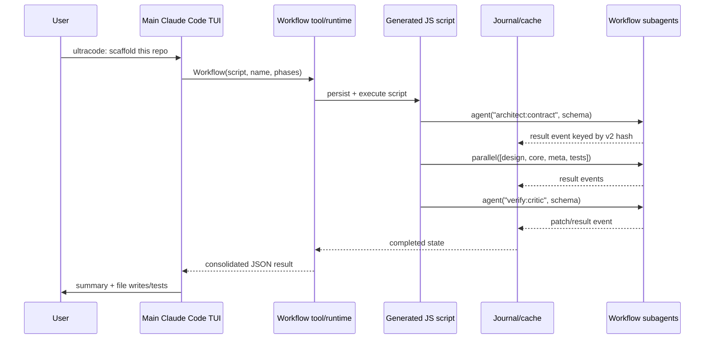
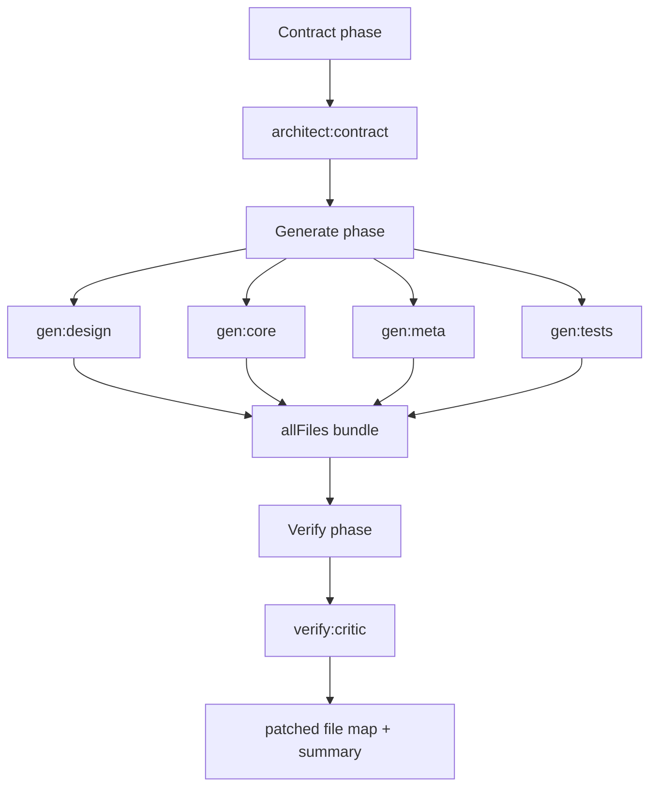
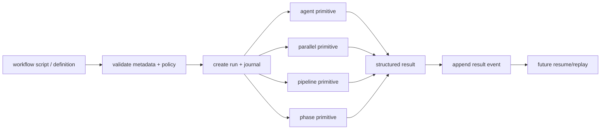

# Claude Code Dynamic Workflows — observations

These notes are from dogfooding Claude Code `ultracode` against this repo while designing a
Hermes analogue. They are empirical observations, not an official spec. Use the official Claude docs
for public API guarantees:

- <https://code.claude.com/docs/en/workflows>
- <https://code.claude.com/docs/en/agent-sdk/typescript>

## High-level product model

Claude Dynamic Workflows move orchestration out of the main chat turn and into a saved JavaScript
workflow script. The script coordinates subagents, while the main conversation stays responsive and
receives the final consolidated result.



## Script shape

The generated workflow script starts with literal metadata:

```js
export const meta = {
  name: 'hermes-plugin-scaffold',
  description: 'Design and scaffold the hermes-plugin-dynamic-workflows repo: contract -> generate -> verify',
  phases: [
    { title: 'Contract', detail: 'define API contract, file manifest, design decisions' },
    { title: 'Generate', detail: 'parallel: DESIGN.md, core package, meta files, tests+example' },
    { title: 'Verify', detail: 'consistency critic patches generated files against contract' },
  ],
}
```

Then it uses orchestration primitives:

```js
phase('Contract')
const contract = await agent(prompt, { label: 'architect:contract', schema: CONTRACT_SCHEMA })

phase('Generate')
const gens = await parallel([
  () => agent(designPrompt, { label: 'gen:design', schema: FILES_SCHEMA }),
  () => agent(corePrompt, { label: 'gen:core', schema: FILES_SCHEMA }),
  () => agent(metaPrompt, { label: 'gen:meta', schema: FILES_SCHEMA }),
  () => agent(testsPrompt, { label: 'gen:tests', schema: FILES_SCHEMA }),
])

phase('Verify')
const critic = await agent(criticPrompt, { label: 'verify:critic', schema: FILES_SCHEMA })
```

The key design pattern: **deterministic script, nondeterministic agents**. The script describes the
DAG and data flow; agents provide judgment/work. That is exactly the split Hermes should copy.

## Runtime artifacts observed

Ad-hoc `ultracode` scripts are not necessarily saved into the repo. In this run the script lived under
Claude's per-project session state:

```text
~/.claude/projects/<project-slug>/<session-id>/workflows/scripts/<workflow-name>-<run-id>.js
```

Workflow runtime state lived under:

```text
~/.claude/projects/<project-slug>/<session-id>/subagents/workflows/<run-id>/
├── journal.jsonl
├── agent-<id>.jsonl
├── agent-<id>.meta.json
├── ...
```

The journal contained compact events like:

```json
{"type":"started","agentId":"a112...","key":"v2:<hash>"}
{"type":"result","agentId":"a112...","key":"v2:<hash>","result":{...}}
```

The `.meta.json` files observed in this run were tiny and only identified the subagent type:

```json
{"agentType":"workflow-subagent"}
```

The detailed transcript lived in `agent-<id>.jsonl`; the aggregate result was also written to a task
output JSON file by Claude Code.

## Run topology observed



The actual run was:

- 6 workflow subagents
- 3 phases: Contract → Generate → Verify
- 4 parallel generators in the Generate phase
- one final consistency critic
- final returned object included package name, primitive list, design decisions, workflow format, and file contents

## Execution semantics to copy into Hermes



Recommended Hermes interpretation:

1. Workflow scripts should coordinate only. They should not get direct shell, filesystem, network,
   imports, process env, clock, or randomness.
2. Child agents perform real work under normal Hermes tool permissions.
3. Structured agent output should be schema-validated before downstream steps can consume it.
4. Journal every step transition so status, replay, and resume become possible.
5. Preserve a lightweight local backend, but allow a Kanban backend for durable engineering workflows.

## What not to copy blindly

- Do not make arbitrary model-written code a trusted runtime. The script is a plan/harness, not a
  permission boundary.
- Do not turn the whole feature into Kanban templates. Kanban is the durable backend option; the core
  value is script-led orchestration outside chat context.
- Do not flood the main conversation with every subagent transcript. Store intermediate artifacts and
  return compact summaries/results.
- Do not assume `parallel` means safe unbounded fanout. Claude documents limits; Hermes needs explicit
  `max_parallel`, run quotas, and operator-visible cancellation.

## Mapping to this prototype

| Claude Dynamic Workflows | This repo |
| --- | --- |
| JS script with `meta` | declarative JSON workflow definition for now |
| `agent(...)` | `kind: "agent"` |
| `parallel([...])` | `kind: "parallel"` |
| `pipeline(...)` / no-barrier flow | top-level ordered steps + `$ref` wiring |
| `phase(...)` | `kind: "phase"` explicit barrier |
| journal/cache | `RunStore` + `RunStatus` skeleton |
| workflow subagents | injected `AgentRunner` boundary |
| saved script/run state | future durable store / Kanban backend |
